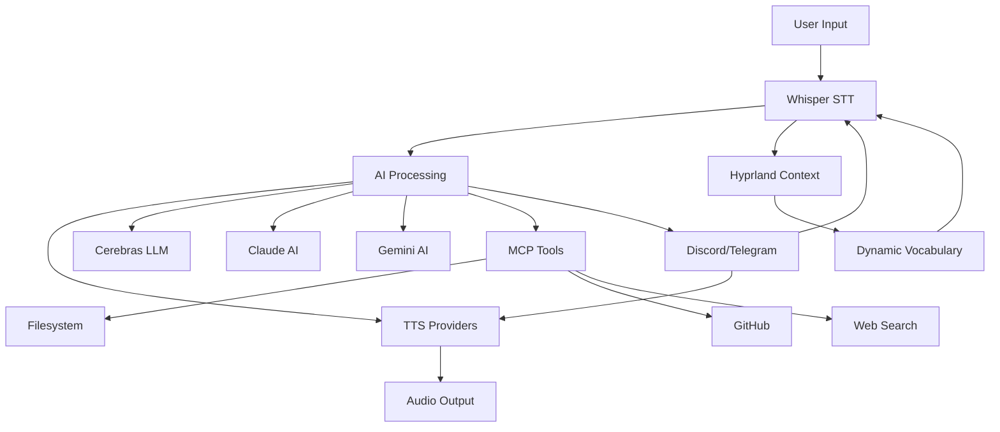

# Integration Documentation Index

This directory contains comprehensive integration guides for all major components of the Hypr-Voice project.

## Available Integration Guides

### 1. [Claude AI SDK Integration](./claude-integration.md)
**Anthropic Claude AI integration with TTS capabilities**

- Claude Agent SDK (API-based)
- Local Claude Code integration
- TTS integration with multiple providers
- Configuration and setup
- Usage examples and best practices
- Troubleshooting

**Key Features:**
- Voice-enabled AI assistant
- Multiple TTS provider support (Kokoro, Deepgram, ElevenLabs)
- Local and API-based Claude support
- Custom system prompts
- Streaming responses

---

### 2. [TTS Integration](./tts-integration.md)
**Text-to-Speech provider integration guide**

- **Kokoro** - Local/open-source TTS
- **Deepgram** - Cloud Aura voices
- **ElevenLabs** - Premium cloud TTS
- Voice library and configuration
- Streaming and auto-play
- Performance optimization

**Key Features:**
- Unified interface for all providers
- Streaming with real-time playback
- Random voice selection
- Batch processing
- Quality vs speed tuning

---

### 3. [Whisper Integration](./whisper-integration.md)
**Speech-to-Text and transcription services**

- **Wispr Flow API** - Primary cloud transcription
- **Hypr-Whisper** - Context-aware local transcription
- Hyprland IPC integration
- Application context monitoring
- Long recording optimization
- Opus encoding for speed

**Key Features:**
- Real-time streaming transcription
- Application-aware vocabulary
- Automatic chunking for long recordings
- 10x faster uploads with Opus
- Context-aware routing

---

### 4. [Cerebras Integration](./cerebras-integration.md)
**High-performance LLM inference with Cerebras Cloud**

- Multiple model support (Llama, Qwen, GPT-OSS)
- API key rotation
- Model selection strategy
- Token limit management
- Performance optimization

**Key Features:**
- Extremely fast inference
- Multiple models (120B, 235B, 480B parameters)
- Automatic key rotation
- Streaming responses
- Code-optimized models

---

### 5. [Gemini Live Integration](./gemini-integration.md)
**Google Gemini Live API for multimodal AI**

- Live API (WebSocket) support
- REST API support
- Multimodal (text + images)
- Vertex AI integration
- Model selection guide

**Key Features:**
- Real-time streaming
- Image analysis
- 1M+ token context
- Thinking models for reasoning
- Code generation models

---

### 6. [MCP Integration](./mcp-integration.md)
**Model Context Protocol server integration**

- Dynamic server loading
- Tool discovery and routing
- Preset servers (Filesystem, GitHub, Git, Search, Databases)
- Custom server creation
- Claude SDK integration

**Key Features:**
- Standardized tool interface
- Filesystem operations
- GitHub integration
- Web search (Brave)
- Database connectivity (PostgreSQL, SQLite)

---

### 7. [Bot Integrations](./bot-integrations.md)
**Discord and Telegram bot integration**

- **Discord Bot** - Full-featured Discord integration
- **Telegram Bot** - Complete Telegram support
- Voice message processing
- File management
- Custom commands
- Multi-platform support

**Key Features:**
- Voice message transcription
- AI-powered responses
- TTS voice responses
- Custom command handling
- File upload/download
- Authentication management

---

### 8. [Hyprland Integration](./hyprland-integration.md)
**Hyprland window manager IPC integration**

- Application context monitoring
- Window switching
- Workspace management
- Context-aware routing
- Vocabulary extraction

**Key Features:**
- Real-time window tracking
- Context-aware voice commands
- Automatic vocabulary updates
- Workspace automation
- Window property queries

---

## Quick Reference

### Minimum Required Environment Variables

```bash
# LLM Provider (Cerebras)
CEREBRAS_API_KEY_ONE=your_key_here

# Transcription (Wispr Flow)
WISPR_FLOW_JWT_TOKEN=your_jwt_token
WISPR_FLOW_BASETEN_API_KEY=your_api_key
WISPR_FLOW_USER_UUID=your_uuid

# TTS (at least one)
DEEPGRAM_API_KEY=your_key_here
# OR
ELEVENLABS_API_KEY=your_key_here
# Kokoro is local (no key needed)

# Optional Integrations
GEMINI_API_KEY=your_gemini_key
GITHUB_TOKEN=your_github_token
DISCORD_BOT_TOKEN=your_discord_token
TELEGRAM_BOT_TOKEN=your_telegram_token
```

### Architecture Overview



## Integration Workflows

### Voice Assistant Pipeline
```
1. Audio Input → Wispr Flow (STT)
2. Transcription → Cerebras/Claude/Gemini (AI)
3. Response → Kokoro/Deepgram/ElevenLabs (TTS)
4. Audio Output
```

### Context-Aware Pipeline
```
1. Hyprland Monitor → Application Context
2. Audio Input → Wispr Flow with Context
3. AI Processing with App Knowledge
4. TTS Response
```

### Bot Pipeline
```
1. Discord/Telegram Message
2. Voice Attachment → Wispr Flow
3. AI Processing
4. TTS → Send Audio Response
```

## Getting Started

### 1. Core Setup
```bash
# Install dependencies
pip install -r requirements.txt

# Configure environment
cp .env.example .env
# Edit .env with your API keys

# Start services
python -m hypr_voice.services.wispr_flow_direct
```

### 2. Choose Your LLM
- **Cerebras**: Fastest, best for real-time (see [Cerebras Integration](./cerebras-integration.md))
- **Claude**: Best for complex reasoning (see [Claude Integration](./claude-integration.md))
- **Gemini**: Best for multimodal (see [Gemini Integration](./gemini-integration.md))

### 3. Choose Your TTS
- **Kokoro**: Local, fastest (see [TTS Integration](./tts-integration.md))
- **Deepgram**: Fast cloud, good quality (see [TTS Integration](./tts-integration.md))
- **ElevenLabs**: Best quality (see [TTS Integration](./tts-integration.md))

### 4. Optional Integrations
- **Hyprland**: For context-aware features (see [Hyprland Integration](./hyprland-integration.md))
- **MCP**: For extended tools (see [MCP Integration](./mcp-integration.md))
- **Bots**: For chat platforms (see [Bot Integrations](./bot-integrations.md))

## Support and Troubleshooting

Each integration guide includes:
- Configuration instructions
- Usage examples
- API reference
- Troubleshooting section
- Best practices
- Integration examples

For issues not covered in the guides, check:
- [Architecture Documentation](./ARCHITECTURE.md)
- [API Documentation](../api/)
- Project repository issues

## Contributing

When adding new integrations:
1. Create a new integration guide following this template
2. Include configuration examples
3. Provide usage examples
4. Add troubleshooting section
5. Update this index

---

**Last Updated**: 2026-01-26
**Version**: 1.0.0
