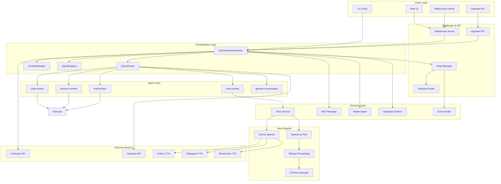
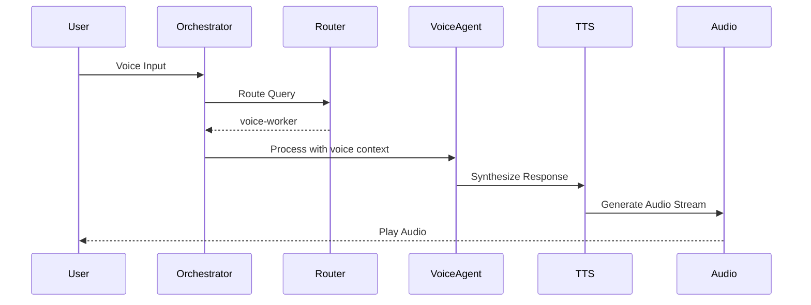
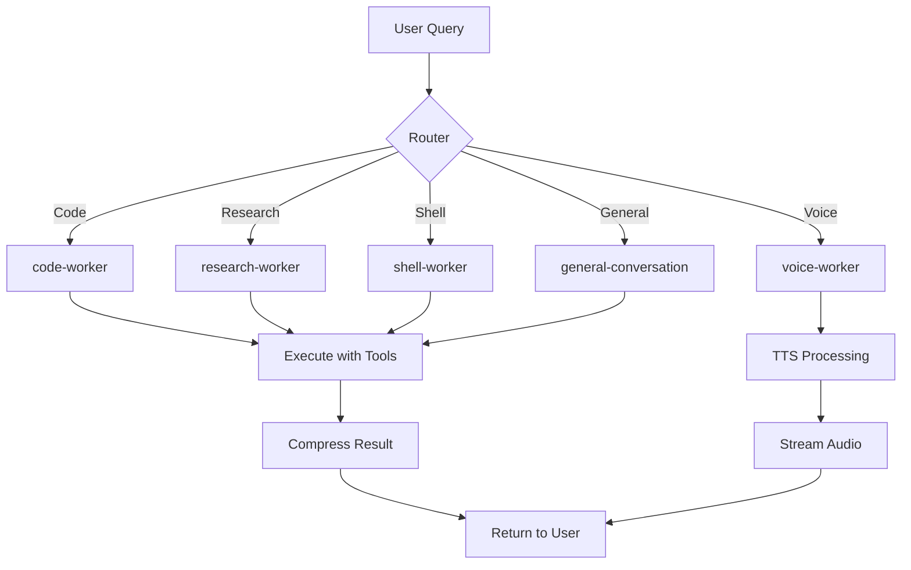
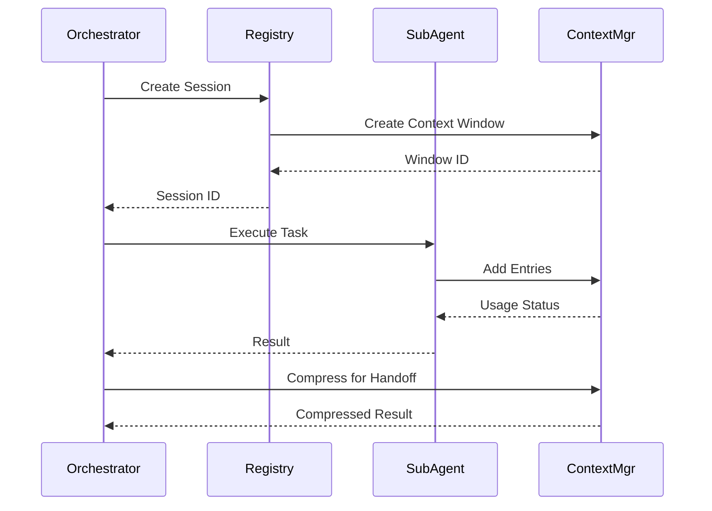
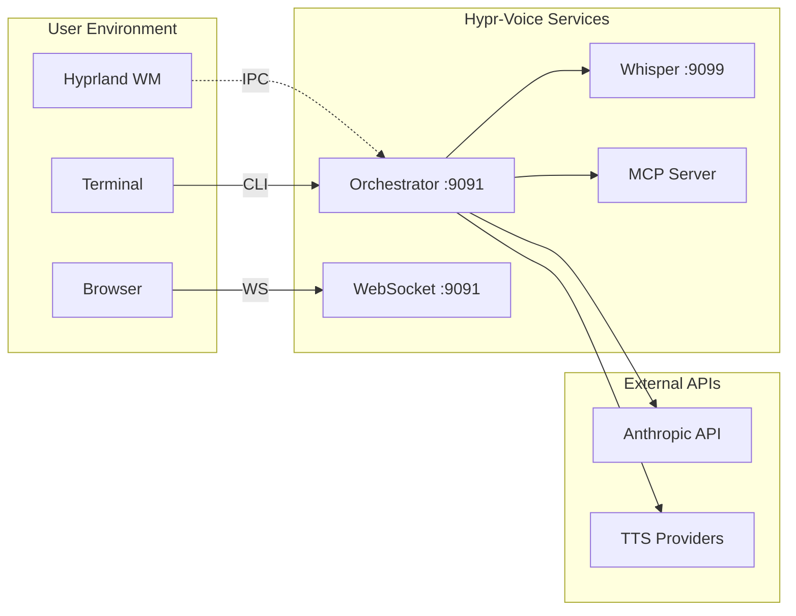

# Hypr-Voice System Architecture

## Overview

Hypr-Voice is a multi-agent orchestration system built on the Claude Agent SDK patterns, providing voice synthesis, speech recognition, and intelligent agent capabilities. The system follows a modular, event-driven architecture with clear separation of concerns.

## High-Level Architecture

## Core Components

### 1. Orchestrator Layer

The orchestrator is the central coordination component that manages agent lifecycles and query routing.

**Key Classes:**
- `HyprVoiceOrchestrator` - Main orchestrator implementing Claude Agent SDK patterns
- `QueryRouter` - Routes queries to appropriate specialized agents
- `CerebrasRouter` - LLM-powered intelligent routing (optional)
- `ContextManager` - Manages context windows with compression strategies
- `AgentRegistry` - Tracks agent sessions and lifecycle

**Responsibilities:**
- Maintain minimal context (routing decisions + final results)
- Delegate specialized tasks to subagents with isolated contexts
- Provide session persistence across conversation turns
- Emit events for monitoring and observability

### 2. Agent Layer

Specialized agents handle specific types of tasks with dedicated tools and prompts.

| Agent Type | Purpose | Model | Tools |
|------------|---------|-------|-------|
| `code-worker` | Code analysis, generation, refactoring | Sonnet | Read, Write, Edit, Grep, Glob |
| `research-worker` | Information gathering, documentation | Haiku | Read, Grep, Glob |
| `shell-worker` | System operations, bash commands | Sonnet | Bash, Read, Grep |
| `voice-worker` | Text-to-speech, speech optimization | Haiku | Read |
| `general-conversation` | Casual chat, life advice | Haiku | None |

### 3. Services Layer

Provides shared capabilities across the system.

**Voice Service (`UniversalTTS`)**
- Multi-provider TTS abstraction (Kokoro, Deepgram, ElevenLabs)
- Voice library management
- Streaming and non-streaming modes
- Audio format conversion

**MCP Manager (`EnhancedMCPManager`)**
- Dynamic MCP server loading
- Tool discovery and registration
- Server lifecycle management
- JSON-RPC protocol implementation

**Helper Agent (`HelperAgent`)**
- Text summarization
- Content analysis
- Task planning
- Claude SDK bridging

**SubAgent System**
- Hierarchical agent spawning
- Parent-child session tracking
- Result aggregation

**Event Hooks (`HookManager`)**
- Agent lifecycle events
- Tool execution hooks
- Context change notifications
- Audit trail logging

### 4. Voice Pipeline

**Whisper Processing Pipeline:**
1. **Audio Input** - Microphone or file
2. **Preprocessing** - Resampling, VAD
3. **TCPGen Decoding** - Vocabulary-biased decoding
4. **Transcription** - Faster Whisper backend
5. **Post-processing** - Punctuation, formatting

### 5. Middleware & IPC

**Hook System**
- Pre/Post tool execution hooks
- User prompt submission hooks
- Agent lifecycle hooks
- Pattern-based hook matching

**Request Router**
- Path-based routing with parameters
- Method-based filtering (QUERY, COMMAND, EVENT, STREAM)
- Middleware chains
- Fallback handlers

**WebSocket Server**
- Real-time agent events
- Subscription-based messaging
- Client connection management
- Query streaming

**Hyprland IPC**
- Window focus detection
- Keybinding triggers (F10 agent mode)
- Notification dispatch
- Workspace tracking

## Technology Stack

### Core Dependencies

| Category | Technology | Purpose |
|----------|-----------|---------|
| **Web Framework** | FastAPI, Uvicorn | HTTP/WebSocket server |
| **AI/ML** | Anthropic SDK, Claude Agent SDK | LLM integration |
| **Audio** | Faster Whisper, Kokoro-ONNX | Speech processing |
| **Async** | asyncio, aiohttp | Asynchronous operations |
| **Configuration** | Pydantic, PyYAML | Settings management |
| **Logging** | Loguru, structlog | Observability |

### Voice Providers

| Provider | Type | Features |
|----------|------|----------|
| **Kokoro** | Local, Free | 17 voices, offline, HTTP streaming |
| **Deepgram** | Cloud, Premium | Aura series, per-char pricing |
| **ElevenLabs** | Cloud, Premium | 44+ voices, cloning |

## Communication Patterns

### 1. HTTP/REST
- Configuration endpoints
- Health checks
- Session management

### 2. WebSocket
- Real-time agent events
- Streaming responses
- Bidirectional messaging

### 3. Unix Sockets
- Hyprland IPC
- Inter-process communication

### 4. JSON-RPC
- MCP protocol
- Tool invocation

## Data Flow

### Query Processing Flow

### Agent Spawning Flow

## Design Principles

### 1. Minimal Context in Orchestrator
- Only routing decisions and final results stored
- Subagents handle task-specific context
- Reduces token usage and improves performance

### 2. Agent Specialization
- Each agent has specific tools and prompts
- Model selection based on task complexity
- Isolated context windows prevent pollution

### 3. Event-Driven Architecture
- Hooks for extensibility
- WebSocket for real-time updates
- Async/await throughout

### 4. Provider Abstraction
- Unified interfaces for TTS/STT
- Easy provider switching
- Fallback mechanisms

### 5. Configuration Over Code
- YAML-based agent definitions
- Environment variable overrides
- Dynamic capability loading

## Deployment Architecture

## Performance Considerations

### Optimization Strategies

1. **Routing Performance**
   - Keyword-based: <1ms
   - Cerebras-based: 2-8s (optional)

2. **Voice Latency**
   - Direct API: ~3s for TTS
   - SDK mode: ~68s (not recommended for voice)

3. **Context Management**
   - Compression at 80% threshold
   - Result caching (MD5 hash)
   - Automatic cleanup of stale sessions

4. **Audio Processing**
   - Streaming for real-time playback
   - Opus compression (24k vs 16k bitrate)
   - Chunking for long recordings

### Scalability

- **Horizontal**: Multiple orchestrator instances
- **Vertical**: Subagent parallelization
- **Resource limits**: Max 100 sessions, 10 per agent type

## Security Considerations

1. **Hook-based validation**
   - Dangerous command blocking
   - Audit trail logging
   - Permission modes

2. **Environment isolation**
   - Separate contexts per agent
   - No shared state
   - Process isolation for MCP servers

3. **Secrets management**
   - Environment variable expansion
   - No hardcoded credentials
   - Secure token handling
