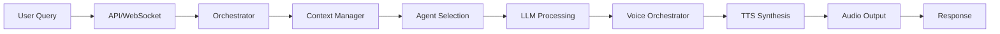
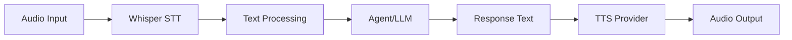

# Code Structure and Organization

This document explains the organization of the Hypr-Voice codebase, including directory structure, module relationships, and architectural patterns.

## Table of Contents

1. [Project Overview](#project-overview)
2. [Directory Structure](#directory-structure)
3. [Core Modules](#core-modules)
4. [Services Layer](#services-layer)
5. [Agent System](#agent-system)
6. [Orchestration](#orchestration)
7. [Data Flow](#data-flow)
8. [Module Dependencies](#module-dependencies)

## Project Overview

Hypr-Voice is a multi-agent voice orchestration system built with:

- **Backend**: Python with FastAPI
- **Frontend**: Next.js 13+ with TypeScript
- **AI/ML**: PyTorch, Transformers, Whisper
- **Architecture**: Event-driven with async/await
- **Communication**: WebSockets, REST API, IPC

```
Hypr-Voice/
├── src/hypr_voice/          # Python source code
├── web-ui/                   # Next.js frontend
├── config/hypr_voice/        # User configuration
├── runtime/                  # Runtime data (logs, audio, DB)
├── scripts/                  # Utility scripts
├── tests/                    # Test suite
└── docs/                     # Documentation
```

## Directory Structure

### Root Level

```
Hypr-Voice/
├── src/                      # Python source
├── web-ui/                   # Frontend application
├── config/                   # Configuration files
├── runtime/                  # Runtime data (created at runtime)
├── scripts/                  # Shell & Python scripts
├── tests/                    # Integration tests
├── docs/                     # Documentation
├── pyproject.toml            # Python project config
├── requirements.txt          # Python dependencies
├── package.json              # Root npm scripts
└── CLAUDE.md                 # Project instructions
```

### Python Source: `src/hypr_voice/`

```
src/hypr_voice/
├── __init__.py               # Package initialization
├── server.py                 # FastAPI application entry point
├── paths.py                  # Centralized path management
│
├── agents/                   # Agent definitions
│   ├── __init__.py
│   ├── definitions.py        # Agent registry & base classes
│   └── enhanced_context_agent.py
│
├── client/                   # Client libraries
│   ├── __init__.py
│   └── agent_client.py       # Python client for API
│
├── cli/                      # Command-line interface
│   └── tts.py                # TTS CLI tool
│
├── config/                   # Configuration management
│   └── __init__.py
│
├── core/                     # Core utilities
│   ├── __init__.py
│   ├── loggurl.py            # Logging configuration
│   └── orchestrator.py       # Core orchestration logic
│
├── examples/                 # Example code
│   ├── quickstart.py
│   └── claude_tts_integration.py
│
├── integrations/             # Third-party integrations
│   ├── e2b_client.py        # E2B sandbox integration
│   └── gemini/              # Google Gemini integration
│
├── ipc/                      # Inter-process communication
│   ├── __init__.py
│   ├── hyprland.py          # Hyprland IPC
│   └── websocket.py         # WebSocket server
│
├── middleware/               # FastAPI middleware
│   ├── __init__.py
│   ├── hooks.py             # Event hooks
│   └── router.py            # Request routing
│
├── orchestrator/             # Orchestration layer
│   ├── __init__.py
│   ├── orchestrator.py      # Main orchestrator
│   ├── voice_orchestrator.py # Voice-specific orchestration
│   ├── context_manager.py   # Conversation context
│   ├── registry.py          # Agent registry
│   ├── router.py            # Request routing
│   └── cerebras_router.py   # Cerebras-specific routing
│
├── services/                 # Service implementations
│   ├── agent_skills/        # Agent skill system
│   ├── claude_tts_agent.py  # Claude + TTS integration
│   ├── voice/               # TTS services
│   │   ├── tts_manager.py   # Multi-provider TTS
│   │   └── test_tts.py      # TTS tests
│   ├── gemini_live/         # Gemini Live integration
│   ├── Cerebras_integration/ # Cerebras integration
│   ├── helper-agent/        # Helper agent service
│   └── hooks/               # Event hooks system
│
├── tools/                    # Utility tools
│   └── ...
│
├── whisper/                  # Whisper STT integration
│   ├── __init__.py
│   ├── tests/               # Whisper tests
│   ├── enhanced_vocabulary.py
│   └── ...
│
└── tests/                    # Unit tests
    └── test_claude_tts_agent.py
```

### Web UI: `web-ui/`

```
web-ui/
├── app/                      # Next.js app directory
│   ├── page.tsx             # Main page
│   ├── layout.tsx           # Root layout
│   └── api/                 # API routes
│
├── components/               # React components
├── lib/                      # Utility libraries
├── public/                   # Static assets
├── package.json              # Node dependencies
└── next.config.js            # Next.js config
```

## Core Modules

### 1. Server (`server.py`)

**Purpose**: FastAPI application entry point

**Key Responsibilities**:
- Initialize all orchestrators
- Define REST API endpoints
- Manage WebSocket connections
- Handle lifecycle events

**Important Classes**:
```python
@app.on_event("startup")
async def startup():
    # Initialize orchestrator, voice orchestrator, agents

@app.post("/api/query")
async def handle_query(req: QueryRequest):
    # Process user queries

@app.websocket("/ws")
async def websocket_endpoint(websocket: WebSocket):
    # Handle WebSocket connections
```

### 2. Paths (`paths.py`)

**Purpose**: Centralized path management for runtime directories

**Key Functions**:
```python
ensure_runtime_directories()  # Create all runtime dirs
get_config_path(filename)     # Resolve config file paths
```

**Key Paths**:
- `RUNTIME_DIR`: All runtime data
- `LOG_DIR`: Application logs
- `AUDIO_OUTPUT_DIR`: Generated audio
- `TTS_OUTPUT_DIR`: TTS output
- `DATABASE_DIR`: SQLite databases
- `CACHE_DIR`: Cached data

### 3. Orchestrator (`orchestrator/`)

**Main Components**:

#### `orchestrator.py`
- `HyprVoiceOrchestrator`: Main orchestration logic
- `OrchestratorConfig`: Configuration dataclass

#### `voice_orchestrator.py`
- `VoiceOrchestrator`: Voice-specific orchestration
- Handles TTS + STT coordination

#### `context_manager.py`
- `ContextManager`: Conversation context
- Manages conversation history

#### `registry.py`
- Agent registration and discovery
- Dynamic agent loading

#### `router.py`
- Request routing logic
- Agent selection

## Services Layer

### TTS Service (`services/voice/`)

**Architecture**: Provider-agnostic TTS

```python
class TTSProvider(Enum):
    KOKORO = "kokoro"
    DEEPGRAM = "deepgram"
    ELEVENLABS = "elevenlabs"

class UniversalTTS:
    async def speak(text, voice, provider) -> Result
```

**Supported Providers**:
1. **Kokoro**: Local ONNX-based TTS (fast, free)
2. **Deepgram**: Cloud API (high quality)
3. **ElevenLabs**: Cloud API (premium quality)

### Claude TTS Agent (`services/claude_tts_agent.py`)

**Purpose**: Integrate Claude AI with TTS

**Key Class**:
```python
class ClaudeTTSAgent:
    async def chat(message) -> Result
    async def synthesize_only(text) -> Result
    async def get_available_voices(provider) -> Result
```

### Gemini Live (`services/gemini_live/`)

**Purpose**: Google Gemini multimodal integration

**Files**:
- `gemini_client.py`: Gemini API client
- `gemini_screen.py`: Screen capture + analysis
- `gemini_tui.py`: Terminal UI
- `integration.py`: Integration with orchestrator

### Helper Agent (`services/helper-agent/`)

**Purpose**: General-purpose AI helper

**Components**:
- LangGraph-based agent
- LiteLLM client for multi-provider support
- Tool system (web search, code execution, etc.)

## Agent System

### Agent Definition (`agents/definitions.py`)

**Base Class**:
```python
class BaseAgent:
    agent_id: str
    agent_type: str
    capabilities: List[str]

    async def process(self, input) -> Output:
        raise NotImplementedError
```

### Enhanced Context Agent (`agents/enhanced_context_agent.py`)

**Purpose**: Context-aware agent with screen/clipboard awareness

**Features**:
- Screen capture integration
- Clipboard monitoring
- Context management

**Usage**:
```python
agent = EnhancedContextAgent(model="claude-sonnet-4-5")
result = await agent.process(
    text="What's on my screen?",
    context={"window": {...}, "clipboard": "..."}
)
```

## Orchestration

### Main Orchestrator Flow

```
User Request → API Endpoint → Orchestrator → Agent Selection
                                            ↓
                                    Context Manager
                                            ↓
                                    Agent Processing
                                            ↓
                                    Voice Orchestrator
                                            ↓
                                    TTS/STT Processing
                                            ↓
                                    Response
```

### WebSocket Communication

```
Client → WebSocket → IPC Layer → Orchestrator → Services
                                              ↓
Client ← WebSocket ← IPC Layer ← Response ← TTS/STT
```

## Data Flow

### Query Processing



### Voice Processing



## Module Dependencies

### Dependency Graph (Simplified)

```
server.py
    ├─→ orchestrator/
    │   ├─→ agents/
    │   ├─→ services/
    │   └─→ context_manager.py
    ├─→ ipc/
    ├─→ middleware/
    └─→ paths.py

services/
    ├─→ voice/
    │   └─→ tts_manager.py
    ├─→ claude_tts_agent.py
    ├─→ gemini_live/
    └─→ helper-agent/

agents/
    └─→ core/
        └─→ orchestrator.py
```

### External Dependencies

**Core**:
- `fastapi`: Web framework
- `pydantic`: Data validation
- `aiohttp`: Async HTTP

**AI/ML**:
- `anthropic`: Claude API
- `openai`: OpenAI API
- `transformers`: Hugging Face models
- `faster-whisper`: Fast STT

**Audio**:
- `kokoro-onnx`: Local TTS
- `deepgram-sdk`: Cloud TTS
- `elevenlabs`: Cloud TTS
- `soundfile`: Audio I/O

**Utilities**:
- `loguru`: Logging
- `rich`: Terminal UI
- `click`: CLI framework

## Configuration System

### Config Resolution Order

1. User config: `config/hypr_voice/config.yaml`
2. Package config: `src/hypr_voice/config/`
3. Environment variables (override)
4. Defaults (fallback)

### Environment Variables

```bash
# Paths
HYPR_VOICE_PROJECT_ROOT
HYPR_VOICE_RUNTIME_DIR
HYPR_VOICE_CONFIG_DIR
HYPR_VOICE_LOG_DIR

# Features
HYPR_VOICE_MODEL
HYPR_VOICE_TTS_PROVIDER
HYPR_VOICE_TTS_VOICE
WHISPER_URL

# API Keys (never commit these)
ANTHROPIC_API_KEY
OPENAI_API_KEY
DEEPGRAM_API_KEY
ELEVENLABS_API_KEY
GOOGLE_API_KEY
```

## Testing Structure

### Test Locations

```
tests/                          # Integration tests
├── integration/
│   └── test_ws.py             # WebSocket tests
└── test_gemini_*.py           # Gemini integration tests

src/hypr_voice/tests/          # Unit tests
└── test_claude_tts_agent.py

src/hypr_voice/services/voice/tests/
└── test_tts.py                # TTS tests

src/hypr_voice/whisper/tests/
├── test_hybrid.py
├── test_vocabulary.py
└── test_enhanced_vocabulary.py
```

## Naming Conventions

### Files
- **Modules**: `snake_case.py` (e.g., `voice_orchestrator.py`)
- **Tests**: `test_*.py` (e.g., `test_tts.py`)
- **Classes**: `PascalCase` (e.g., `VoiceOrchestrator`)
- **Functions/Methods**: `snake_case` (e.g., `synthesize_speech`)

### Directories
- **Services**: Plural (`services/`, `agents/`, `tools/`)
- **Modules**: Singular if single file (`orchestrator/`)

### Imports
```python
# Absolute imports (preferred)
from hypr_voice.orchestrator import HyprVoiceOrchestrator
from hypr_voice.services.voice.tts_manager import UniversalTTS

# Relative imports (within package)
from .orchestrator import HyprVoiceOrchestrator
from ..services.voice import TTSProvider
```

## Best Practices

1. **Async/Await**: All I/O operations should be async
2. **Type Hints**: Use for all public functions
3. **Error Handling**: Use custom exceptions, log everything
4. **Testing**: Write tests for new features
5. **Documentation**: Docstrings for all public APIs
6. **Configuration**: Use environment variables for secrets
7. **Logging**: Use `loguru` logger, not `print()`

## Next Steps

- Learn [Coding Standards](coding-standards.md)
- Read [Testing Guide](testing.md)
- See [Adding Features](adding-features.md)
