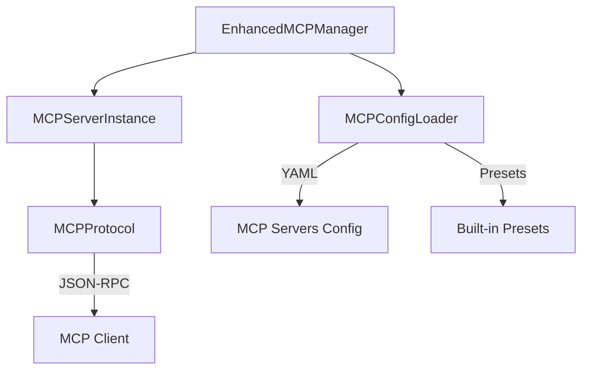

# Hypr-Voice Component Documentation

This document provides detailed technical documentation for all major components in the Hypr-Voice system.

## Table of Contents

1. [Orchestrator Components](#orchestrator-components)
2. [Agent Definitions](#agent-definitions)
3. [Voice Services](#voice-services)
4. [MCP Integration](#mcp-integration)
5. [Middleware System](#middleware-system)
6. [IPC Layer](#ipc-layer)
7. [Tools Registry](#tools-registry)

---

## Orchestrator Components

### HyprVoiceOrchestrator

**Location:** `/src/hypr_voice/orchestrator/orchestrator.py`

**Purpose:** Central coordination point for the entire agent system. Implements Claude Agent SDK patterns for multi-agent orchestration.

**Class Signature:**
```python
class HyprVoiceOrchestrator:
    def __init__(
        self,
        config: Optional[OrchestratorConfig] = None,
        use_cerebras_router: bool = False
    )
```

**Configuration Options:**
| Parameter | Type | Default | Description |
|-----------|------|---------|-------------|
| `model` | str | "claude-sonnet-4-5" | LLM model to use |
| `max_turns` | int | 1 | Maximum conversation turns |
| `enable_subagents` | bool | False | Enable subagent spawning |
| `enable_context_compression` | bool | True | Enable context compression |
| `working_directory` | str | None | Root directory for file operations |
| `allowed_tools` | list | [Read, Write, Edit, ...] | Permitted tools |

**Key Methods:**

#### `async process(query: str, session_id: Optional[str] = None) -> AsyncIterator[dict]`

Process a query through the orchestration pipeline.

**Yields:**
- `route_decision` - Agent routing decision
- `text` - Text content chunks
- `tool_use` - Tool invocation events
- `result` - Final completion event

**Example:**
```python
orchestrator = HyprVoiceOrchestrator()
async for chunk in orchestrator.process("Write a Python function"):
    if chunk["type"] == "text":
        print(chunk["content"])
```

#### `async process_streaming(query: str, context: Optional[dict] = None) -> AsyncIterator[dict]`

Process with token-level streaming for real-time TTS.

**Yields:**
- `token` - Individual text tokens
- `route` - Routing decision
- `result` - Completion event

#### `async spawn_agent(agent_type: str, task: str, parent_session: Optional[str] = None) -> str`

Spawn a specialized subagent.

**Returns:** New session ID

**Raises:** `ValueError` if agent_type is unknown

#### `async destroy_agent(session_id: str) -> bool`

Destroy an agent session and cleanup resources.

**Returns:** True if successful

---

### QueryRouter

**Location:** `/src/hypr_voice/orchestrator/router.py`

**Purpose:** Fast keyword-based routing to specialized agents.

**Agent Types:**
```python
class AgentType(str, Enum):
    CODE = "code-worker"
    RESEARCH = "research-worker"
    SHELL = "shell-worker"
    VOICE = "voice-worker"
    GENERAL = "general-conversation"
    ORCHESTRATOR = "orchestrator"
```

**Routing Algorithm:**
1. Score each agent type by keyword matches (+0.1 per match)
2. Apply regex pattern matching (+0.3 per match)
3. Multiply by agent weight (0.8-1.1)
4. Return highest-scoring agent with confidence score

**Example Usage:**
```python
router = QueryRouter()
decision = router.route("Create a Python function for sorting")
# decision.agent_type == "code-worker"
# decision.confidence == 0.7
# decision.reasoning == "Query involves code-related tasks"
```

**Custom Pattern Addition:**
```python
router.add_pattern(
    AgentType.CODE,
    keywords=["refactor", "optimize"],
    patterns=[r"improve\s+performance"]
)
```

---

### CerebrasRouter

**Location:** `/src/hypr_voice/orchestrator/cerebras_router.py`

**Purpose:** LLM-powered intelligent routing using Cerebras API.

**Trade-offs:**
- **Pros:** More nuanced routing, handles ambiguous queries
- **Cons:** 2-8s latency vs <1ms for keyword router

**Usage:**
```python
orchestrator = HyprVoiceOrchestrator(use_cerebras_router=True)
```

**Environment Variables:**
- `CEREBRAS_API_KEY` - Cerebras API key
- `CEREBRAS_ROUTER_TIMEOUT` - Request timeout (default 10s)

---

### ContextManager

**Location:** `/src/hypr_voice/orchestrator/context_manager.py`

**Purpose:** Manages context windows with compression strategies.

**Key Features:**
- Subagent isolation (separate context per agent)
- Result summarization (compress output before returning)
- Automatic compaction at 80% threshold
- Deduplication caching (MD5 hash)

**Data Structures:**
```python
@dataclass
class ContextEntry:
    content: str
    entry_type: str  # "query", "result", "tool_use", "system"
    timestamp: str
    token_estimate: int
    agent_id: Optional[str]
    metadata: dict

@dataclass
class ContextWindow:
    agent_id: str
    max_tokens: int = 100000
    entries: list[ContextEntry]
    total_tokens: int
    compression_threshold: float = 0.8
```

**Methods:**

#### `compress_result(result: str, max_tokens: int = 500) -> str`

Compress a result for efficient storage.

**Strategies:**
1. Remove empty lines and excess whitespace
2. Truncate long lines (200 char max)
3. Keep first 40%, last 40%, summarize middle

#### `summarize_for_handoff(agent_id: str) -> str`

Create summary for agent-to-orchestrator handoff.

**Returns:** Concatenated "result" entries or last 3 entries

---

### AgentRegistry

**Location:** `/src/hypr_voice/orchestrator/registry.py`

**Purpose:** Track agent lifecycle and session state.

**Session States:**
```python
class AgentStatus(str, Enum):
    CREATED = "created"
    RUNNING = "running"
    PAUSED = "paused"
    COMPLETED = "completed"
    ERROR = "error"
    DESTROYED = "destroyed"
```

**Key Methods:**

| Method | Purpose |
|--------|---------|
| `create_session()` | Create new agent session |
| `update_session()` | Update session state/result |
| `start_session()` | Mark as running |
| `complete_session()` | Mark as completed |
| `error_session()` | Mark as errored |
| `destroy_session()` | Destroy and archive |
| `spawn_child()` | Create child subagent |
| `get_children()` | Get child sessions |
| `get_stats()` | Registry statistics |

**Capacity Management:**
- Maximum 100 concurrent sessions
- Automatic cleanup of completed sessions
- History limited to 1000 completed sessions

---

## Agent Definitions

### AgentDefinition

**Location:** `/src/hypr_voice/agents/definitions.py`

**Purpose:** Define specialized agent configurations.

**Structure:**
```python
@dataclass
class AgentDefinition:
    name: str                    # Unique identifier
    description: str             # When to use this agent
    prompt: str                  # System prompt
    tools: list[str]             # Allowed tools
    model: AgentModel            # sonnet, opus, haiku, inherit
```

**Predefined Agents:**

#### CodeAgent
- **Model:** Sonnet (balanced)
- **Tools:** Read, Write, Edit, Grep, Glob
- **Focus:** Code analysis, generation, refactoring

#### ResearchAgent
- **Model:** Haiku (cost-efficient)
- **Tools:** Read, Grep, Glob
- **Focus:** Documentation, research, examples

#### ShellAgent
- **Model:** Sonnet
- **Tools:** Bash, Read, Grep
- **Focus:** System operations, file management

#### VoiceAgent
- **Model:** Haiku (fast)
- **Tools:** Read
- **Focus:** Text-to-speech optimization

**Creating Custom Agents:**
```python
from hypr_voice.agents import create_agent

custom_agent = create_agent(
    name="documentation-writer",
    description="Write technical documentation",
    prompt="You are a technical writer...",
    tools=["Read", "Write", "Grep"],
    model="sonnet"
)
```

---

## Voice Services

### UniversalTTS

**Location:** `/src/hypr_voice/services/voice/`

**Purpose:** Multi-provider text-to-speech abstraction.

**Providers:**

| Provider | Type | Voices | Streaming | Cost |
|----------|------|--------|-----------|------|
| Kokoro | Local | 17 | HTTP | Free |
| Deepgram | Cloud | Aura series | HTTP | Per-char |
| ElevenLabs | Cloud | 44+ | HTTP | Per-char |

**TTSConfig:**
```python
@dataclass
class TTSConfig:
    provider: TTSProvider = TTSProvider.KOKORO
    voice: str = "af_bella"
    speed: float = 1.0
    use_streaming: bool = True
    stream_and_play: bool = False
    output_dir: Optional[str] = None
```

**Usage:**
```python
from hypr_voice.services.voice import text_to_speech, list_all_voices

# Synthesize speech
result = await text_to_speech(
    text="Hello, world!",
    provider="kokoro",
    voice="af_bella"
)

# List available voices
voices = await list_all_voices(provider="kokoro")
```

**Voice Naming Convention:**
- `af_` - American Female
- `am_` - American Male
- `bf_` - British Female
- `bm_` - British Male
- Special: `emotional_`, `child_`, `robot_`

---

### Whisper Processing

**Location:** `/src/hypr_voice/whisper/`

**Components:**

#### HybridWhisperClient
- REST API and WebSocket support
- Session management
- File transcription
- Real-time streaming

**Usage:**
```python
from hypr_voice.whisper.core import HybridWhisperClient

client = HybridWhisperClient("http://localhost:9099")

# Create session
session_id = client.create_session(language="en")

# Transcribe file
result = client.transcribe_file("audio.mp3")

# Stream microphone
await client.stream_microphone_ws(sample_rate=16000)
```

#### TCPGen Decoder
- Vocabulary-biased decoding
- Prefix tree (trie) matching
- Lambda interpolation (0.3 vocab, 0.7 original)

**Performance Gains:**
- whisper-tiny: 27% WER reduction
- whisper-small: 29% WER reduction
- whisper-base: 37% WER reduction
- whisper-medium: 60% WER reduction

**Usage:**
```python
from hypr_voice.whisper.processors import TCPGenDecoder

decoder = TCPGenDecoder(
    vocabulary=["FastAPI", "Docker", "Kubernetes"],
    tokenizer=whisper_model.hf_tokenizer,
    lambda_bias=0.3
)

biased_logits = decoder.bias_logits(logits, current_tokens)
```

---

## MCP Integration

### EnhancedMCPManager

**Location:** `/src/hypr_voice/services/mcp/mcp_loader.py`

**Purpose:** Dynamic MCP server loading and management.

**Architecture:**



**Preset Servers:**

| Name | Package | Purpose |
|------|---------|---------|
| filesystem | @modelcontextprotocol/server-filesystem | File operations |
| github | @modelcontextprotocol/server-github | GitHub API |
| git | @modelcontextprotocol/server-git | Git operations |
| brave-search | @modelcontextprotocol/server-brave-search | Web search |
| postgres | @modelcontextprotocol/server-postgres | PostgreSQL |
| sqlite | @modelcontextprotocol/server-sqlite | SQLite |

**Usage:**
```python
from hypr_voice.services.mcp import EnhancedMCPManager

manager = EnhancedMCPManager()

# Add preset server
await manager.add_preset_server("filesystem")

# Load from config
await manager.load_from_config("mcp_config.yaml")

# Call tool
result = await manager.call_tool(
    "filesystem",
    "read_file",
    {"path": "/etc/hosts"}
)

# Get all tools
tools = manager.get_all_tools()
```

**MCP Protocol Implementation:**

The system implements the MCP (Model Context Protocol) JSON-RPC specification:

- **initialize** - Server handshake
- **tools/list** - Discover available tools
- **tools/call** - Execute a tool
- **resources/list** - List resources
- **prompts/list** - List prompts

---

## Middleware System

### HookManager

**Location:** `/src/hypr_voice/middleware/hooks.py`

**Purpose:** Event interception and modification.

**Hook Events:**
```python
class HookEvent(str, Enum):
    PRE_TOOL_USE = "PreToolUse"
    POST_TOOL_USE = "PostToolUse"
    USER_PROMPT_SUBMIT = "UserPromptSubmit"
    AGENT_STARTED = "AgentStarted"
    AGENT_COMPLETED = "AgentCompleted"
    STOP = "Stop"
    SUBAGENT_STOP = "SubagentStop"
    PRE_COMPACT = "PreCompact"
```

**Hook Result:**
```python
@dataclass
class HookResult:
    allow: bool = True
    modified_input: Optional[dict] = None
    system_message: Optional[str] = None
    metadata: dict = field(default_factory=dict)
```

**Built-in Hooks:**

1. **logging_hook** - Log all tool usage
2. **dangerous_command_hook** - Block harmful bash commands
3. **audit_hook** - Log to audit file

**Custom Hook Example:**
```python
from hypr_voice.middleware import HookManager, HookEvent

async def my_hook(input_data, tool_use_id, context):
    # Modify input before tool execution
    if input_data.get("tool_name") == "Bash":
        command = input_data["tool_input"]["command"]
        if "rm" in command:
            return HookResult.deny_action("Destructive command blocked")
    return HookResult.allow_action()

manager = HookManager()
manager.register(HookEvent.PRE_TOOL_USE, my_hook, matcher="Bash")
```

---

### RequestRouter

**Location:** `/src/hypr_voice/middleware/router.py`

**Purpose:** Path-based request routing.

**Route Methods:**
```python
class RouteMethod(str, Enum):
    QUERY = "QUERY"      # Information retrieval
    COMMAND = "COMMAND"  # State-changing operations
    EVENT = "EVENT"      # Event notifications
    STREAM = "STREAM"    # Streaming responses
```

**Usage:**
```python
from hypr_voice.middleware import RequestRouter, RouteMethod

router = RequestRouter()

# Add route
router.add_route(
    pattern="/agents/{id}/status",
    method=RouteMethod.QUERY,
    handler=get_agent_status,
    description="Get agent status"
)

# Route request
result = await router.route(
    path="/agents/abc123/status",
    method=RouteMethod.QUERY,
    data={}
)
# result.params == {"id": "abc123"}
```

**Decorator Pattern:**
```python
from hypr_voice.middleware import query

@query("/agents/{id}/status", "Get agent status")
async def get_agent_status(context):
    agent_id = context.params["id"]
    return {"status": "running", "id": agent_id}
```

---

## IPC Layer

### WebSocket Server

**Location:** `/src/hypr_voice/ipc/websocket.py`

**Purpose:** Real-time communication for web UI and external clients.

**Default:** ws://localhost:9091

**Message Types:**
- `ping/pong` - Heartbeat
- `subscribe/unsubscribe` - Topic subscriptions
- `query` - Send query to orchestrator
- `spawn_agent` - Spawn new agent
- `destroy_agent` - Destroy agent
- `list_agents` - List active agents

**Usage:**
```python
from hypr_voice.ipc import OrchestratorWebSocket

server = OrchestratorWebSocket(host="0.0.0.0", port=9091)
await server.start()

# Broadcast to all subscribers
await server.broadcast(
    {"type": "agent_spawned", "session_id": "abc123"},
    topic="agents"
)

# Send to specific client
await server.send_to_client(client_id, {"type": "response", "data": "..."})
```

---

### Hyprland IPC

**Location:** `/src/hypr_voice/ipc/hyprland.py`

**Purpose:** Integration with Hyprland compositor.

**Capabilities:**
- Window focus tracking
- Workspace monitoring
- Keybinding triggers (F10 agent mode)
- Notification dispatch

**Usage:**
```python
from hypr_voice.ipc import HyprlandIPC, send_notification

ipc = HyprlandIPC()

# Get active window
window = await ipc.get_active_window()

# Dispatch command
await ipc.dispatch("exec", "alacritty")

# Send notification
await send_notification(
    title="Agent Mode",
    message="Processing your request...",
    urgency="normal"
)
```

**Agent Mode Handler:**
```python
from hypr_voice.ipc import AgentModeHandler

handler = AgentModeHandler()

# F10 press - start recording
await handler.on_key_press()

# F10 release - process transcription
await handler.on_key_release(transcribed_text="Hello world")
```

---

## Tools Registry

### Tool Registry

**Location:** `/src/hypr_voice/tools/`

**Purpose:** Centralized tool management for Claude Agent SDK.

**Tool Definition:**
```python
from hypr_voice.tools import tool

@tool(
    name="synthesize_speech",
    description="Convert text to speech",
    input_schema={
        "text": str,
        "voice": str,
        "output_path": str
    },
    category="voice"
)
async def synthesize_speech(args: dict) -> dict:
    text = args.get("text", "")
    # ... implementation
    return {"content": [{"type": "text", "text": "Speech synthesized"}]}
```

**Builtin Tools:**
- `synthesize_speech` - Text-to-speech
- `transcribe_audio` - Speech-to-text
- File operations (via SDK)
- Code operations (via SDK)

**MCP Tool Conversion:**
```python
from hypr_voice.tools import create_mcp_server

server = create_mcp_server(tools=[synthesize_speech])
```

---

## Configuration

### Environment Variables

| Variable | Purpose | Default |
|----------|---------|---------|
| `ANTHROPIC_API_KEY` | Anthropic API key | - |
| `ANTHROPIC_BASE_URL` | Custom API endpoint | - |
| `ANTHROPIC_DEFAULT_SONNET_MODEL` | Model override | claude-sonnet-4-5 |
| `CEREBRAS_API_KEY` | Cerebras API key | - |
| `DEEPGRAM_API_KEY` | Deepgram TTS key | - |
| `ELEVENLABS_API_KEY` | ElevenLabs key | - |
| `HYPRLAND_INSTANCE_SIGNATURE` | Hyprland IPC | - |
| `PULSE_SOURCE` | Audio input device | - |

### Configuration Files

**MCP Config (`~/.config/hypr-voice/mcp.yaml`):**
```yaml
mcp_servers:
  filesystem:
    command: npx
    args: ["-y", "@modelcontextprotocol/server-filesystem", "/"]
    enabled: true
  github:
    command: npx
    args: ["-y", "@modelcontextprotocol/server-github"]
    env:
      GITHUB_TOKEN: "${GITHUB_TOKEN}"
```

---

## Testing

### Component Testing

**Orchestrator:**
```python
from hypr_voice.orchestrator import HyprVoiceOrchestrator

orchestrator = HyprVoiceOrchestrator()
async for chunk in orchestrator.process("Write hello world"):
    print(chunk)
```

**Voice:**
```python
from hypr_voice.services.voice import text_to_speech

result = await text_to_speech("Test", provider="kokoro")
assert result["success"]
```

**MCP:**
```python
from hypr_voice.services.mcp import EnhancedMCPManager

manager = EnhancedMCPManager()
await manager.add_preset_server("filesystem")
tools = manager.get_all_tools()
assert len(tools) > 0
```

---

## Debugging

### Logging

```python
from loguru import logger
logger.add("hypr_voice.log", rotation="10 MB")
```

### Observability

**Events Emitted:**
- `query_received` - User query submitted
- `route_decision` - Agent selected
- `agent_spawned` - Subagent created
- `agent_destroyed` - Subagent terminated
- `query_completed` - Processing finished

**Subscribe to Events:**
```python
orchestrator = HyprVoiceOrchestrator()

def handler(event):
    print(f"{event.event_type}: {event.data}")

orchestrator.register_event_handler(handler)
```
