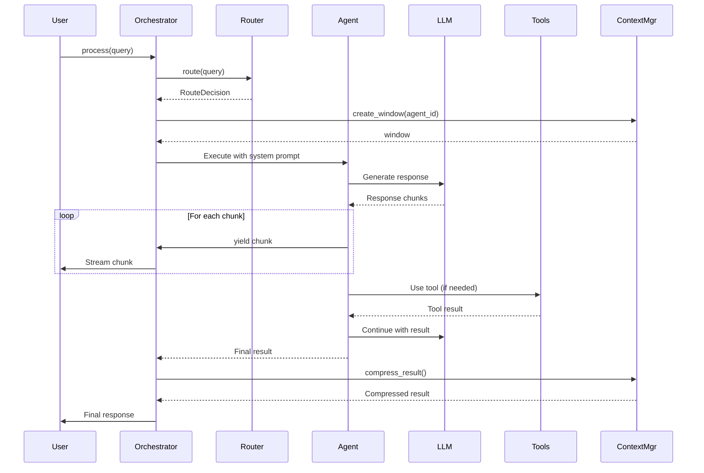
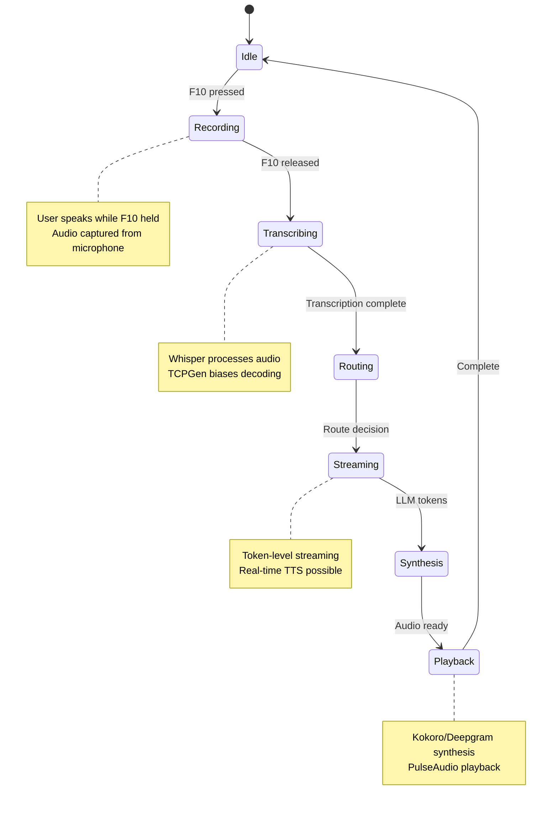
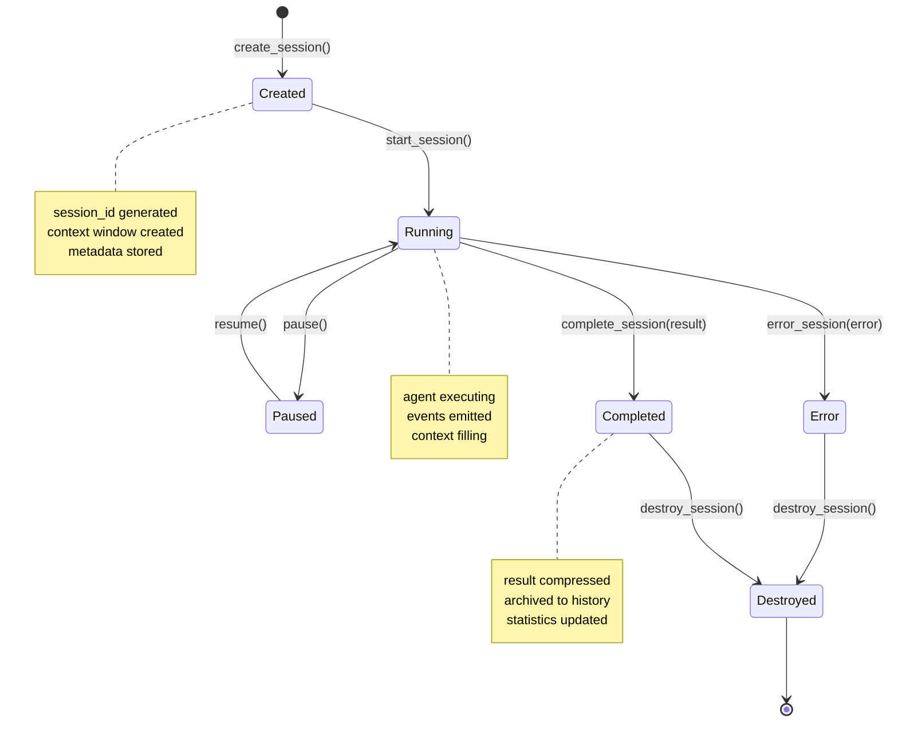
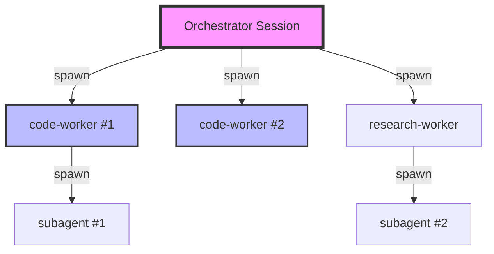
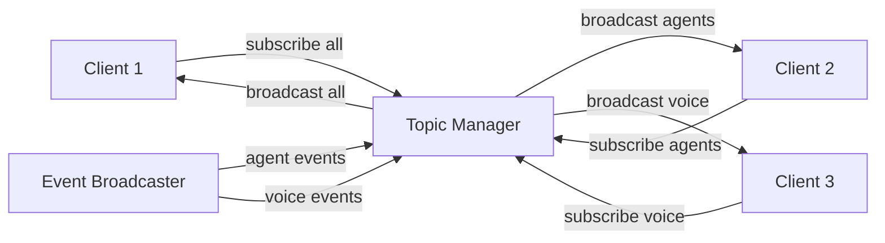
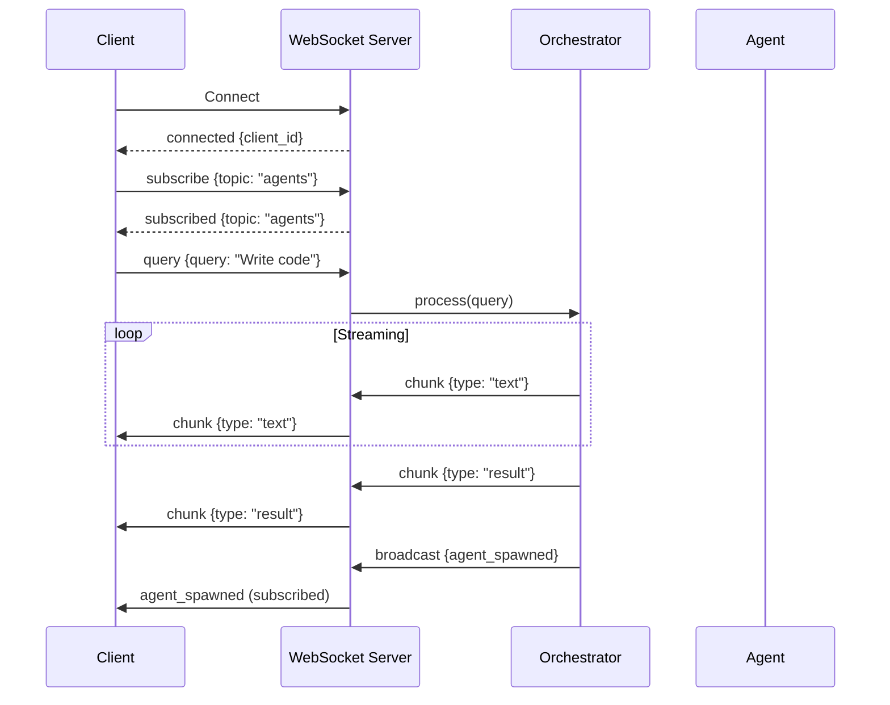
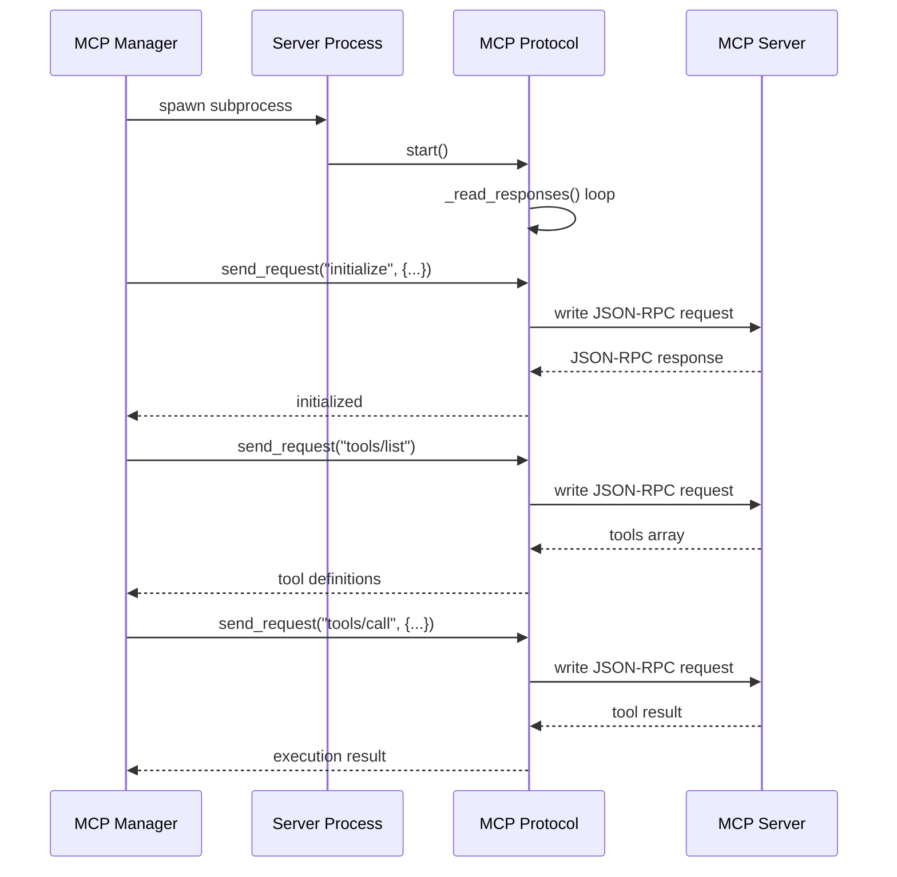
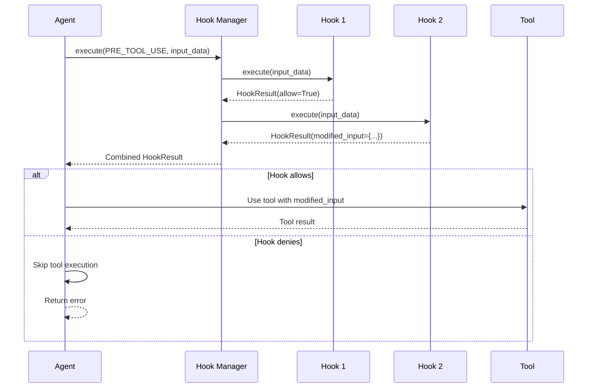
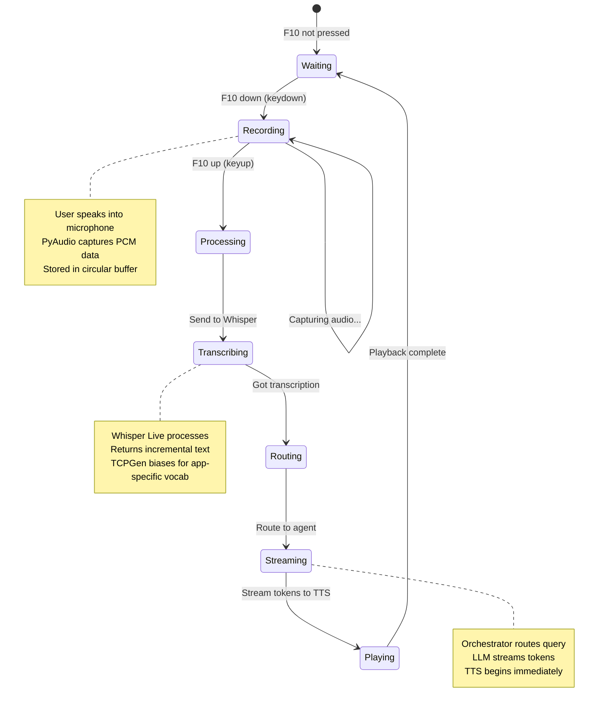
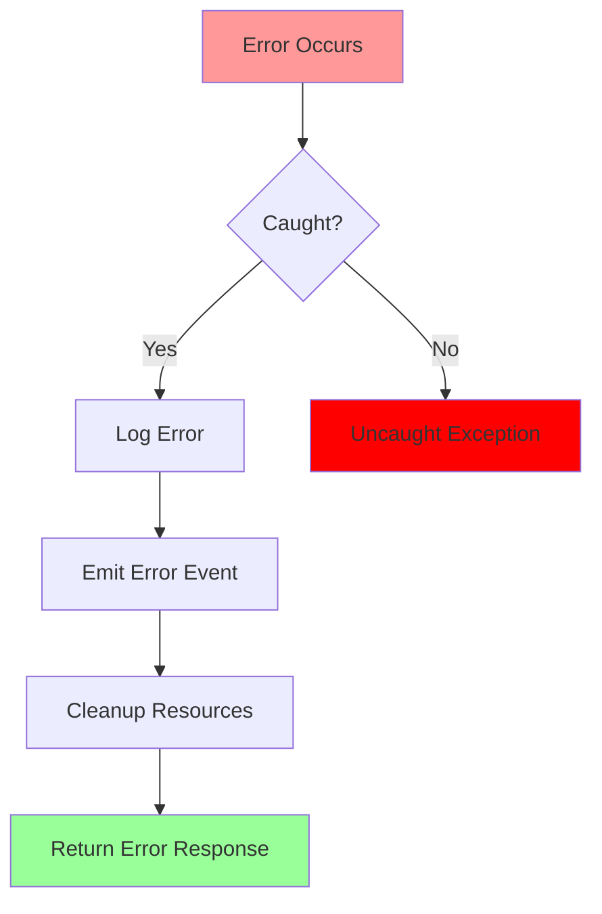

# Hypr-Voice Data Flow and Communication Patterns

This document describes how data flows through the Hypr-Voice system and the communication patterns used between components.

## Table of Contents

1. [Query Processing Flow](#query-processing-flow)
2. [Voice Interaction Flow](#voice-interaction-flow)
3. [Agent Lifecycle Flow](#agent-lifecycle-flow)
4. [WebSocket Communication](#websocket-communication)
5. [MCP Protocol Flow](#mcp-protocol-flow)
6. [Hook Execution Flow](#hook-execution-flow)
7. [Hyprland Integration Flow](#hyprland-integration-flow)

---

## Query Processing Flow

### Standard Query Flow



### Data Transformation Pipeline

**Input Query:**
```
"Write a Python function that sorts a list of dictionaries"
```

**Stage 1: Routing**
```json
{
  "type": "route_decision",
  "route": "code-worker",
  "confidence": 0.85,
  "reasoning": "Query involves code-related tasks",
  "keywords_matched": ["code", "function", "python"]
}
```

**Stage 2: Agent Invocation**
```python
{
  "agent": "code-worker",
  "model": "sonnet",
  "system_prompt": "You are a specialized code agent...",
  "allowed_tools": ["Read", "Write", "Edit", "Grep", "Glob"]
}
```

**Stage 3: LLM Response Streaming**
```python
# Each chunk yielded
{"type": "text", "content": "Here's a Python function", "agent": "code-worker"}
{"type": "text", "content": " that sorts dictionaries:", "agent": "code-worker"}
# ...
```

**Stage 4: Tool Execution (if needed)**
```json
{
  "type": "tool_use",
  "tool": "Write",
  "input": {"file_path": "sort_dicts.py", "content": "..."}
}
```

**Stage 5: Final Result**
```json
{
  "type": "result",
  "content": "Completed",
  "session_id": "abc123...",
  "turns": 1,
  "cost_usd": 0.0021
}
```

---

## Voice Interaction Flow

### F10 Agent Mode (Hyprland Integration)



### Voice Processing Pipeline


**Audio Flow Details:**

1. **Capture:**
   - PyAudio: 16kHz, 1 channel, int16
   - Chunk size: 4096 samples
   - Device: `PULSE_SOURCE` env var

2. **Transmission:**
   - WebSocket: Binary audio frames
   - Conversion: int16 -> float32 [-1, 1]
   - Chunk interval: 10ms

3. **Transcription:**
   - Whisper Live: Real-time VAD
   - TCPGen: Vocabulary biasing
   - Output: Incremental text

4. **Routing:**
   - QueryRouter: <1ms
   - Or CerebrasRouter: 2-8s
   - Decision: Agent type + confidence

5. **Generation:**
   - LLM: Streaming tokens
   - Interval: 50-100ms per token
   - Context: Agent-specific prompt

6. **Synthesis:**
   - Kokoro: HTTP streaming
   - Deepgram: WebSocket streaming
   - Format: WAV/Opus

7. **Playback:**
   - PulseAudio: Direct stream
   - Buffering: 200-500ms
   - Latency: <1s total

---

## Agent Lifecycle Flow

### Session State Machine



### Parent-Child Relationships



**Relationship Tracking:**
```python
# Parent session
parent_session = {
    "session_id": "orch-123",
    "agent_type": "orchestrator",
    "status": "running"
}

# Child session
child_session = registry.spawn_child(
    parent_id="orch-123",
    agent_type="code-worker",
    query="Implement feature X"
)

# Child inherits context
child_session.metadata = {
    "spawned_from": "orch-123",
    "parent_agent_type": "orchestrator"
}
```

---

## WebSocket Communication

### Message Protocol

**Client to Server:**

```json
{
  "type": "query|spawn_agent|destroy_agent|list_agents|ping|subscribe|unsubscribe",
  "query": "...",           // for query
  "agent_type": "...",      // for spawn_agent
  "task": "...",            // for spawn_agent
  "session_id": "...",      // for destroy_agent
  "topic": "..."            // for subscribe/unsubscribe
}
```

**Server to Client:**

```json
{
  "type": "chunk|route_decision|result|error|agent_spawned|pong|subscribed",
  "content": "...",         // text content
  "route": "...",           // agent type
  "confidence": 0.85,       // routing confidence
  "agent": "...",           // agent type
  "session_id": "...",      // session ID
  "error": "..."            // error message
}
```

### Subscription Model



**Topic Categories:**
- `all` - All events
- `agents` - Agent lifecycle
- `voice` - Voice synthesis
- `transcription` - Speech recognition

### WebSocket Event Flow



---

## MCP Protocol Flow

### JSON-RPC Communication



### Request Format

**Initialize Request:**
```json
{
  "jsonrpc": "2.0",
  "id": 1,
  "method": "initialize",
  "params": {
    "protocolVersion": "0.1.0",
    "capabilities": {
      "tools": true,
      "resources": true,
      "prompts": true
    }
  }
}
```

**Tool Call Request:**
```json
{
  "jsonrpc": "2.0",
  "id": 2,
  "method": "tools/call",
  "params": {
    "name": "read_file",
    "arguments": {
      "path": "/etc/hosts"
    }
  }
}
```

### Response Format

**Success Response:**
```json
{
  "jsonrpc": "2.0",
  "id": 2,
  "result": {
    "content": [
      {
        "type": "text",
        "text": "127.0.0.1 localhost..."
      }
    ]
  }
}
```

**Error Response:**
```json
{
  "jsonrpc": "2.0",
  "id": 2,
  "error": {
    "code": -32602,
    "message": "Invalid params"
  }
}
```

### MCP Tool Discovery

```python
# 1. Server starts
await server.start()

# 2. Initialize handshake
result = await server.protocol.initialize()

# 3. Discover tools
tools_data = await server.protocol.list_tools()
for tool in tools_data:
    print(f"Tool: {tool['name']}")
    print(f"  Description: {tool['description']}")
    print(f"  Schema: {tool['inputSchema']}")

# 4. Convert to Claude format
claude_tools = [
    {
        "name": f"{server_name}_{tool['name']}",
        "description": f"[MCP:{server_name}] {tool['description']}",
        "input_schema": tool['inputSchema']
    }
    for tool in tools_data
]
```

---

## Hook Execution Flow

### Pre-Tool-Use Hook



### Hook Priority and Chaining

```python
# Hooks are sorted by priority (higher = earlier)
hooks = [
    Hook(name="audit", priority=1),      # Runs first
    Hook(name="validation", priority=10), # Runs second
    Hook(name="logging", priority=20),    # Runs third
]

# Execution order
for hook in sorted_hooks:
    result = await hook.execute(context)
    if not result.allow:
        break  # Stop chain

    if result.modified_input:
        input_data = result.modified_input  # Pass to next
```

### Hook Result Propagation

```python
# Hook 1: Add metadata
result1 = HookResult(
    allow=True,
    metadata={"stage": "validation"}
)

# Hook 2: Modify input
result2 = HookResult(
    allow=True,
    modified_input={"command": "safe_" + command},
    system_message="Command sanitized"
)

# Combined result
final = {
    "allow": True,
    "modified_input": {"command": "safe_ls"},
    "system_message": "Command sanitized",
    "metadata": {"stage": "validation"}  # Merged
}
```

---

## Hyprland Integration Flow

### F10 Agent Mode Sequence



### Hyprland Event Handling

```python
# 1. Start event listener
await hypr_ipc.start_event_listener()

# 2. Register event handler
def on_activewindow(event: HyprlandEvent):
    window_info = json.loads(event.data)
    app_name = window_info.get("class", "")

    # Update vocabulary for app
    hook_bus.emit("vocab_change", app_name=app_name)

hypr_ipc.on_event("activewindow", on_activewindow)

# 3. Event loop
while running:
    line = await reader.readline()
    event = HyprlandEvent.parse(line)
    # Dispatch to handlers
```

### Notification Dispatch

```python
# Send notification via notify-send
await send_notification(
    title="Agent Mode",
    message="Processing your request...",
    urgency="normal",  # low, normal, critical
    timeout=5000,       # milliseconds
    app_name="Hypr-Voice"
)

# Implementation via subprocess
proc = await asyncio.create_subprocess_exec(
    "notify-send",
    "-a", "Hypr-Voice",
    "-u", "normal",
    "-t", "5000",
    "Agent Mode",
    "Processing your request..."
)
```

---

## Data Formats

### Session Data

```json
{
  "session_id": "550e8400-e29b-41d4-a716-446655440000",
  "agent_type": "code-worker",
  "status": "running",
  "query": "Write a sorting function",
  "created_at": "2024-01-26T10:30:00Z",
  "updated_at": "2024-01-26T10:30:15Z",
  "parent_id": null,
  "result": null,
  "error": null,
  "metadata": {
    "turns": 1,
    "tokens_used": 450,
    "cost_usd": 0.0015
  }
}
```

### Context Entry

```json
{
  "content": "def sort_dicts(items, key):...",
  "type": "result",
  "timestamp": "2024-01-26T10:30:10Z",
  "tokens": 120,
  "agent_id": "code-worker-123",
  "metadata": {
    "tool_used": "Write",
    "file_path": "sort_dicts.py"
  }
}
```

### Route Decision

```json
{
  "agent_type": "code-worker",
  "confidence": 0.85,
  "reasoning": "Query involves code-related tasks. Matched keywords: code, function, python",
  "keywords_matched": ["code", "function", "python"],
  "should_parallelize": false,
  "secondary_agents": []
}
```

---

## Performance Metrics

### Latency Breakdown

| Stage | Typical | Best | Worst |
|-------|---------|------|-------|
| Routing (keyword) | <1ms | <1ms | <1ms |
| Routing (Cerebras) | 5s | 2s | 8s |
| LLM (first token) | 800ms | 300ms | 2s |
| LLM (per token) | 80ms | 40ms | 200ms |
| TTS (Kokoro) | 200ms | 100ms | 500ms |
| TTS (Deepgram) | 150ms | 80ms | 400ms |
| STT (Whisper) | 300ms | 100ms | 1s |

### Throughput

| Component | Rate |
|-----------|------|
| Orchestrator queries | ~100 req/s |
| WebSocket messages | ~1000 msg/s |
| Audio streaming | 16 KB/s (16kHz) |
| LLM tokens | 10-20 tokens/s |

---

## Error Handling

### Error Propagation



### Error Response Format

```json
{
  "type": "error",
  "error": "Failed to synthesize speech",
  "details": {
    "provider": "kokoro",
    "code": "CONNECTION_ERROR",
    "message": "Connection refused"
  },
  "timestamp": "2024-01-26T10:30:00Z",
  "session_id": "abc123..."
}
```

---

## Security Considerations

### Input Validation

```python
# 1. Hook-based validation
async def validate_bash(input_data, tool_use_id, context):
    if input_data["tool_name"] == "Bash":
        command = input_data["tool_input"]["command"]
        if "rm -rf /" in command:
            return HookResult.deny_action("Dangerous command")
    return HookResult.allow_action()

# 2. Size limits
MAX_QUERY_LENGTH = 10000
if len(query) > MAX_QUERY_LENGTH:
    raise ValueError("Query too long")

# 3. Sanitization
def sanitize_path(path: str) -> str:
    # Remove directory traversal
    path = path.replace("..", "").replace("~", "")
    # Ensure absolute path
    return os.path.abspath(path)
```

### Audit Trail

```python
# All events logged
audit_entry = {
    "timestamp": datetime.utcnow().isoformat(),
    "event": "tool_called",
    "agent_id": "code-worker-123",
    "tool_name": "Bash",
    "input": {"command": "ls -la"},
    "result": "success"
}

# Write to audit log
with open("/var/log/hypr_voice/audit.log", "a") as f:
    f.write(json.dumps(audit_entry) + "\n")
```
