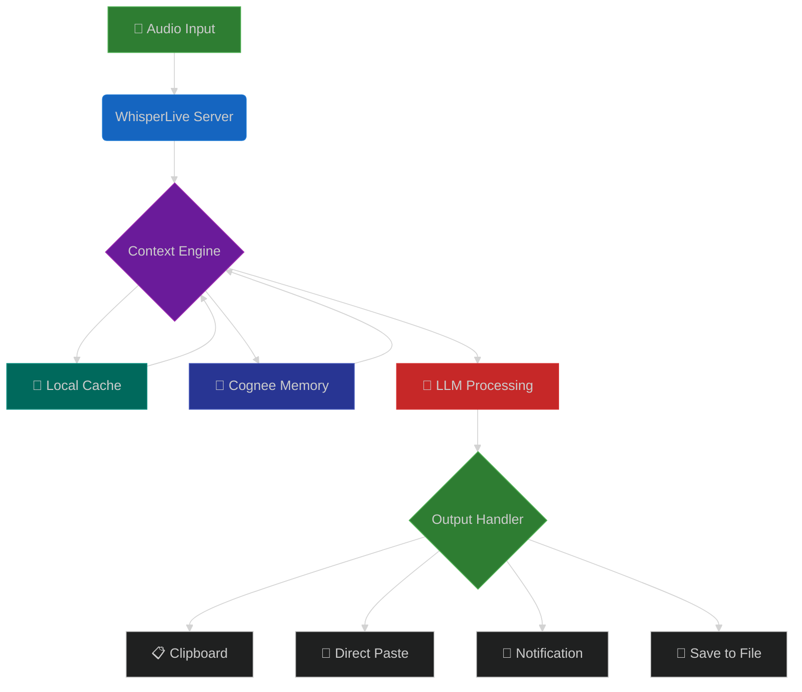
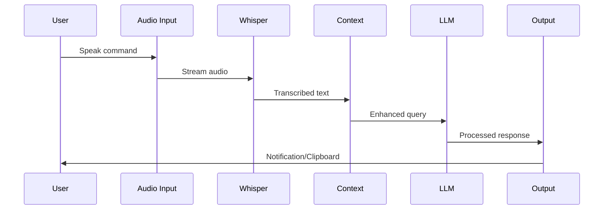

# Hypr-Voice 🎤

A context-aware voice input system for Arch Linux with Hyprland, featuring intelligent transcription and LLM-enhanced text processing.

## Features

### Core Capabilities
- **Real-time Voice Transcription** using WhisperLive with VAD (Voice Activity Detection)
- **Context-Aware Processing** with per-application profiles
- **Multi-Provider LLM Support** (Ollama, OpenAI, Anthropic, Google, xAI)
- **Intelligent Memory System** using Cognee for persistent context
- **Hyprland Integration** with automatic window detection
- **Clipboard & Notification Actions** for seamless workflow

### Advanced Features
- **Push-to-Talk & Continuous Modes** for flexible input
- **Application Profiles** for context-specific text improvement
- **Memory Persistence** across sessions
- **Multi-Language Support** with Whisper
- **GPU Acceleration** with CUDA support
- **WebSocket Streaming** for low-latency communication

## Architecture Overview



### Key Data Flows


## Installation

### Prerequisites

1. **System Requirements**
   - Arch Linux with Hyprland
   - Python 3.10+
   - CUDA (optional, for GPU acceleration)
   - LanceDB (hosted or local) for vector storage (Cognee)

2. **System Packages**
   ```bash
   sudo pacman -S python python-pip redis
   sudo pacman -S wl-clipboard libnotify wtype
   sudo pacman -S sox ffmpeg
   ```

3. **Ollama** (for local LLM)
   ```bash
   curl -fsSL https://ollama.ai/install.sh | sh
   ollama pull llama3.1
   ollama pull codellama
   ```

### Setup

1. **Clone the repository**
   ```bash
   cd /home/mewtwo/Code/Hypr-V/hypr-voice
   ```

2. **Create virtual environment**
   ```bash
   python -m venv venv
   source venv/bin/activate
   ```

3. **Install dependencies**
   ```bash
   pip install -r requirements.txt
   ```

4. **Configure environment**
   ```bash
   cp .env.example .env
   # Edit .env with your API keys (optional)
   ```

5. **Start services**
   ```bash
   # Start Ollama
   ollama serve

   # Start Whisper Server
   python whisper_server.py
   ```

## Usage

### Basic Usage

1. **Start the client**
   ```bash
   python hypr_voice_client.py
   ```

2. **List audio devices**
   ```bash
   python hypr_voice_client.py --list-devices
   ```

3. **Use specific device**
   ```bash
   python hypr_voice_client.py --device 2
   ```

4. **Push-to-talk mode**
   ```bash
   python hypr_voice_client.py --push-to-talk
   ```

### Keyboard Shortcuts

- **SIGUSR1**: Toggle recording (can bind to a key in Hyprland)
- **Ctrl+C**: Exit application

### Hyprland Configuration

Add to your `~/.config/hypr/hyprland.conf`:

```conf
# Hypr-Voice bindings
bind = SUPER, V, exec, pkill -SIGUSR1 -f hypr_voice_client.py  # Toggle recording
bind = SUPER SHIFT, V, exec, python /path/to/hypr_voice_client.py --push-to-talk
```

### Notification Actions

When text is transcribed, you'll see a notification with options:
- **COPY**: Copy to clipboard
- **PASTE**: Paste at cursor
- **EDIT**: Open in default editor
- **IMPROVE**: Re-process with higher quality

## Configuration

### Application Profiles

Edit `config/app_profiles.yaml` to customize behavior per application:

```yaml
terminal:
  writing_style: technical
  context_rules:
    - Preserve command syntax
    - Use shell abbreviations
  llm_config:
    model: codellama
    temperature: 0.1
```

### LLM Providers

Configure providers in `config/llm_providers.yaml`:

```yaml
providers:
  ollama:
    enabled: true
    base_url: http://localhost:11434
    default_model: llama3.1
    
  openai:
    enabled: false
    api_key: ${OPENAI_API_KEY}
```

### Custom Profiles

Create custom profiles for any application:

```python
from context_engine_cognee import ApplicationProfile

profile = ApplicationProfile(
    app_name="my_app",
    writing_style="formal",
    context_rules=["Be concise", "Use technical terms"],
    llm_config={"model": "llama3.1", "temperature": 0.3}
)
```

## API Reference

### Whisper Server

- `POST /sessions` - Create transcription session
- `GET /sessions` - List active sessions  
- `GET /sessions/{id}` - Get session status
- `DELETE /sessions/{id}` - Delete session
- `WS /ws/{id}` - WebSocket for streaming

### Context Engine

```python
from context_engine_cognee import CogneeContextEngine as ContextEngine

engine = ContextEngine()

# Set active application
await engine.set_active_application("vscode")

# Process transcription
result = await engine.process_transcription(
    text="create a python function",
    improve=True
)

# Get suggestions
suggestions = await engine.get_suggestions(text, count=3)
```

## Troubleshooting

### Common Issues

1. **No audio input detected**
   - Check device permissions: `ls -l /dev/snd/`
   - Test with: `arecord -l`

2. **Whisper server not responding**
   - Check if running: `curl http://localhost:9880/`
   - Check logs: `tail -f logs/whisper_server.log`

3. **LLM not working**
   - Verify Ollama: `ollama list`
   - Check model: `ollama run llama3.1`

4. **Clipboard not working**
   - Install: `sudo pacman -S wl-clipboard`
   - Test: `echo "test" | wl-copy`

### Performance Optimization

1. **Use GPU acceleration**
   ```bash
   export CUDA_VISIBLE_DEVICES=0
   python whisper_server.py
   ```

2. **Adjust VAD settings**
   ```python
   config = TranscriptionConfig(
       vad_aggressiveness=3,  # More aggressive filtering
       beam_size=3  # Faster but less accurate
   )
   ```

3. **Use smaller models**
   ```bash
   export WHISPER_MODEL=tiny  # Faster transcription
   ```

## Development

### Project Structure

```
hypr-voice/
├── whisper_server.py      # Enhanced Whisper server
├── context_engine_cognee.py # Context and LLM management (Cognee + LanceDB)
├── hypr_voice_client.py   # Main client application
├── config/
│   ├── app_profiles.yaml  # Application profiles
│   └── llm_providers.yaml # LLM configurations
├── logs/                  # Application logs
└── models/               # Whisper model cache
```

### Testing

```bash
# Test client
python hypr_voice_client.py --help

# Test specific profile
python - <<'PY'
from context_engine_cognee import CogneeContextEngine as ContextEngine
import asyncio

async def test():
    engine = ContextEngine()
    await engine.set_active_application('terminal')
    result = await engine.process_transcription('list all files')
    print(result)

asyncio.run(test())
PY
```

### Contributing

1. Fork the repository
2. Create a feature branch
3. Make your changes
4. Run tests
5. Submit a pull request

## Advanced Usage

### Custom Memory Backend

```python
import cognee
from cognee.modules.search.types import SearchType

# Configure Cognee
cognee.config.set_llm_provider("custom")
cognee.config.set_vector_db_provider("lancedb")
cognee.config.set_vector_db_key("your_lancedb_api_key")

# Add data and search
await cognee.add(data="your content", dataset_name="my_dataset")
results = await cognee.search(query_text="search query", query_type=SearchType.RAG_COMPLETION)
```

### Multi-Agent Workflows

```python
from langchain_ollama import ChatOllama
from langgraph import Graph

# Create agent graph
graph = Graph()
graph.add_node("transcribe", transcribe_agent)
graph.add_node("improve", improve_agent)
graph.add_edge("transcribe", "improve")
```

### Custom Notification Actions

```python
def handle_notification_action(action: str, text: str):
    if action == "translate":
        # Custom translation logic
        pass
    elif action == "summarize":
        # Custom summarization
        pass
```

## License

MIT License - See LICENSE file for details

## Acknowledgments

- OpenAI Whisper for transcription
- Ollama for local LLM inference
- Cognee for knowledge graph memory management
- LanceDB for vector storage
- VoyageAI for embeddings
- Hyprland community for the amazing WM

## Documentation

For detailed technical documentation and future plans see:
- [ARCHITECTURE.md](docs/ARCHITECTURE.md) - System architecture and design decisions
- [API_REFERENCE.md](docs/API_REFERENCE.md) - Core module interfaces
- [DEVELOPER.md](docs/DEVELOPER.md) - Contribution guidelines
- [FEATURES.md](docs/FEATURES.md) - Roadmap and use cases

## Support

For issues and questions:
- [GitHub Issues](https://github.com/yourorg/hyper-voice/issues)
- [Documentation](https://yourorg.github.io/hyper-voice/)
- [Discord Server](https://discord.gg/yourinvite)

---

**Made with ❤️ for the Hyprland community**

<div align="center">
  
  
</div>
- [GitHub Issues](https://github.com/yourorg/hyper-voice/issues)
- [Documentation](https://yourorg.github.io/hyper-voice/)
- [Discord Server](https://discord.gg/yourinvite)

---

**Made with ❤️ for the Hyprland community**

<div align="center">
  
  
</div>
