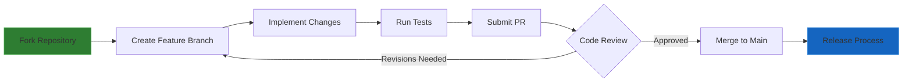
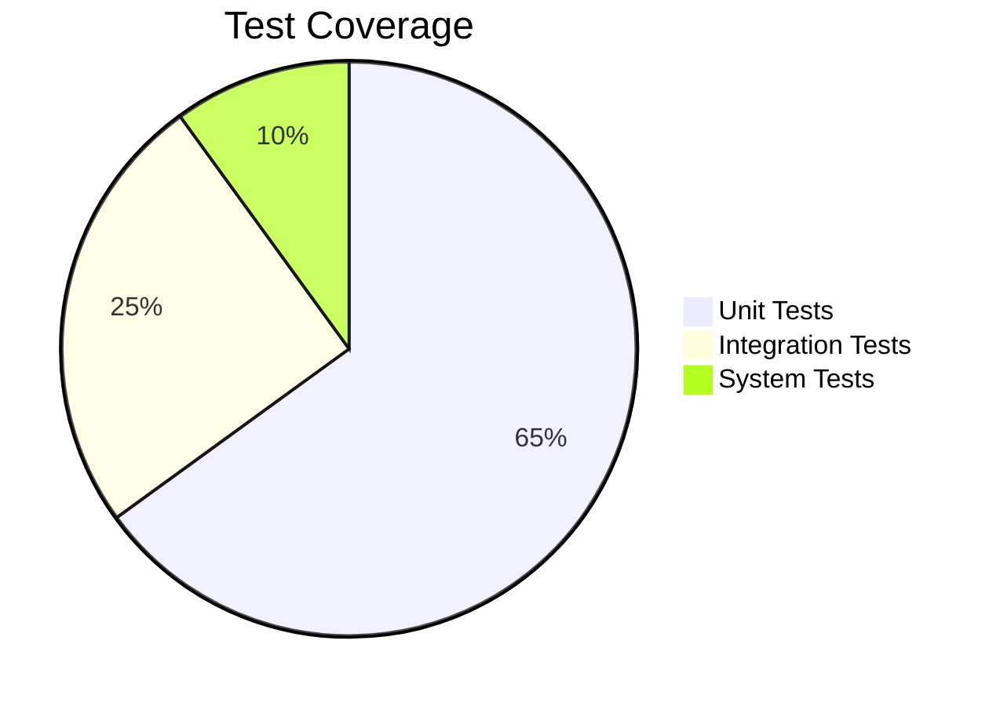

# Hypr-Voice Developer Documentation

## Contribution Workflow

## Code Style Guidelines

- Python PEP8 compliance enforced via flake8
- Type hints required for all function signatures  
- Docstrings using Google style format
- 120 character line limit

## Testing Requirements

## Release Process

1. Update version in `pyproject.toml`
2. Run changelog generator: `cz changelog`
3. Create signed tag: `cz bump --check-consistency`
4. Push tag to trigger CI/CD pipeline