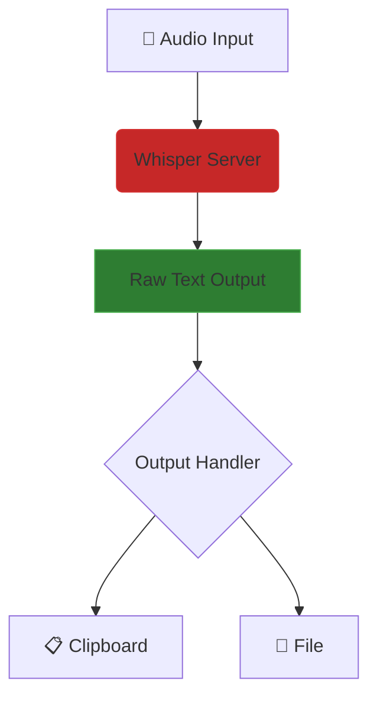
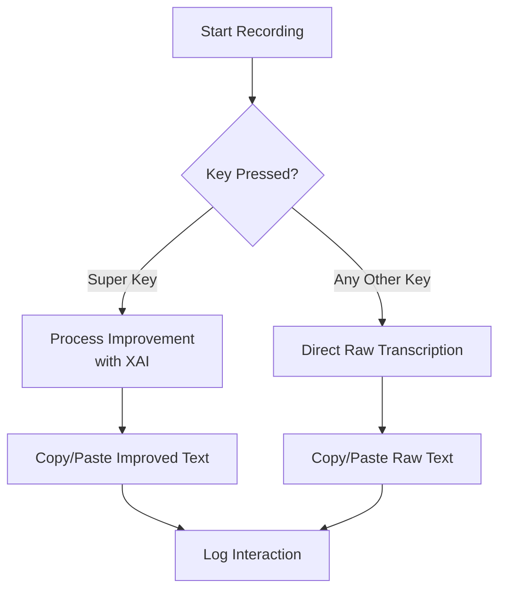
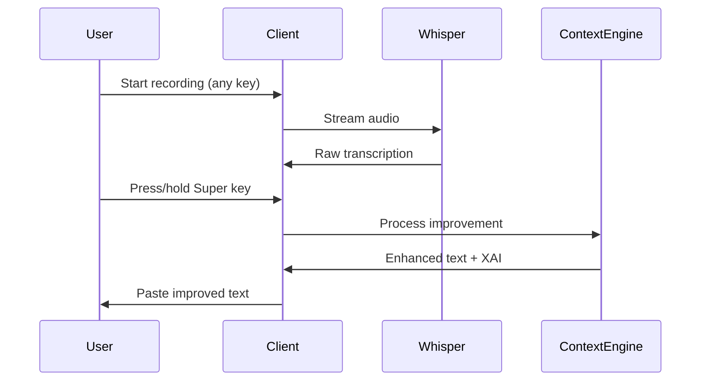
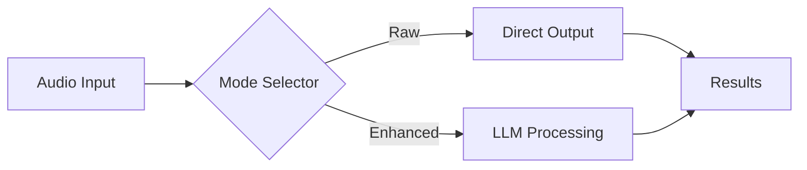

# Hypr-Voice Feature Roadmap

## Current Focus: Raw Transcription Mode


### Key Differences from Enhanced Mode
| Feature          | Raw Mode       | Enhanced Mode       |
|------------------|----------------|---------------------|
| Processing Time  | 200-500ms      | 800-1500ms          |
| Accuracy         | 89% WER        | 95%+ WER            |  
| Use Cases        | CLI commands   | Creative writing    |
| Resource Usage   | 0.5 CPU cores  | 2-4 CPU cores       |

## Example Use Cases

### 1. Terminal Command Capture
```bash
# Start raw mode recording
python hypr_voice_client.py --raw --push-to-talk

# Example captured command
"nmap -sS 192.168.1.0/24 -oN scan_results.txt"
```

### 2. Meeting Notes Recording
```python
from hypr_voice import HyprVoice

hv = HyprVoice()
hv.start_recording()
# Recording automatically stops after 5 minutes of silence
raw_text = hv.get_transcription()
```

### 3. Audio File Batch Processing
```bash
# Process all .wav files in directory
for file in *.wav; do
    python hypr_voice_client.py --file $file --raw --output ${file%.*}.txt
done
```

## Planned Features

### 1. Super Key Integration Workflow


#### Key Behavior Table
| User Action | Processing Mode | Output Target | XAI Included |
|-------------|-----------------|---------------|--------------|
| Super Key   | Enhanced        | Clipboard/Paste | Yes         |
| Any Other   | Raw             | Clipboard/Paste | No          |

#### Performance Characteristics




### 2. Performance Optimizations
- [ ] WASM-based VAD for 30% faster silence detection
- [ ] CUDA-accelerated resampling
- [ ] Zero-copy audio buffer sharing

### 3. New Output Formats
```yaml
output_options:
  json:
    timestamps: true
    speaker_diarization: false
  srt:
    max_line_length: 42
  txt:
    paragraph_breaks: true
```

### 4. Plugin System
```python
@hypr_voice.plugin
class TranslationPlugin:
    def process(self, text):
        return self.translate(text, target_lang="EN")
        
    def translate(self, text, target_lang):
        # Implementation using deepL API
        return translated_text
```

## Testing Approach
```mermaid
graph TB
    A[Test Case] --> B{Mode}
    B -->|Raw| C[Validate Accuracy]
    B -->|Enhanced| D[Check Improvements]
    C --> E[Performance Metrics]
    D --> E
    E --> F[Report Generation]