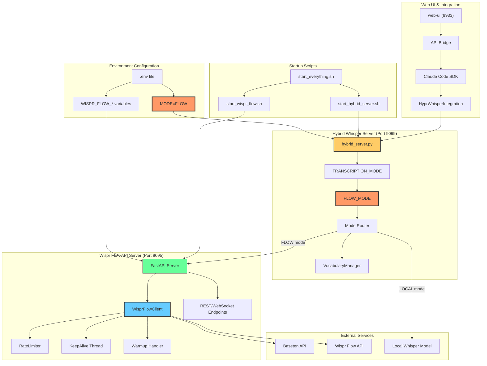

# 📊 Codebase Reference Report: `flow|Flow|Whisper|Wisper`

> Generated analysis for pattern: `flow|Flow|Whisper|Wisper`
> Search prompt: "find all the things related to flow mode in the whisper"
>
> **Updated:** 2026-01-25 - Complete FLOW mode analysis with new package structure

---

## 📋 Quick Summary

| # | File | Line | Entity | Type | Brief Description |
|:-:|:-----|:----:|:-------|:-----|:------------------|
| 1 | `src/hypr_voice/whisper/core/hybrid_server.py` | 57-89 | `TRANSCRIPTION_MODE`, `FLOW_MODE` | variable | Controls LOCAL vs FLOW transcription mode |
| 2 | `src/hypr_voice/whisper/core/hybrid_server.py` | 61-87 | `FLOW_SERVER_URL`, `FLOW_TIMEOUT` | variable | Wispr Flow API connection settings |
| 3 | `src/hypr_voice/services/wispr_flow_server.py` | 1-1741 | `WisprFlowClient` | class | Main Wispr Flow API client implementation |
| 4 | `src/hypr_voice/services/wispr_flow_server.py` | 33-65 | `Settings` | class | Pydantic settings for Wispr Flow configuration |
| 5 | `src/hypr_voice/services/wispr_flow_server.py` | 418-840 | `WisprFlowClient.transcribe()` | method | Transcribe audio with full context support |
| 6 | `.env` | 96 | `MODE=FLOW` | env_var | Environment variable to enable FLOW mode |
| 7 | `.env` | 82-102 | `WISPR_FLOW_*` | env_var | Wispr Flow API configuration variables |
| 8 | `scripts/start_wispr_flow.sh` | 1-176 | `start_wispr_flow.sh` | script | Startup script for Wispr Flow API server |
| 9 | `scripts/start_everything.sh` | 16-32 | `start_flow()` | function | Start Wispr Flow API server from all-services script |
| 10 | `src/hypr_voice/services/WISPR_FLOW_API.md` | 1-337 | `WISPR_FLOW_API.md` | docs | Complete Wispr Flow API documentation |
| 11 | `src/wisper-flow/README.md` | 1-61 | `Wispr Fast` | package | Standalone transcription toolkit |
| 12 | `src/wisper-flow/transcribe.py` | 1-200+ | `transcribe_file()` | function | High-level transcription function |
| 13 | `src/hypr_voice/whisper/vocabulary/add_vocabulary.py` | 1-172 | `VocabularyManager` | class | Custom vocabulary management |
| 14 | `config/hypr_voice/whisper/config.yaml` | 1-125 | `config.yaml` | config | Main Whisper configuration file |
| 15 | `src/hypr_voice/services/tools/hypr_whisper_integration.py` | 1-200+ | `HyprWhisperIntegration` | class | Claude Code SDK integration |

---

## 🗺️ Architecture Visualization



---

## 📑 Detailed Reference Analysis

---

### Reference #1

| Field | Value |
|:------|:------|
| **@file_path** | `src/hypr_voice/whisper/core/hybrid_server.py` |
| **@lineno** | 57-89 |
| **@entity_name** | `TRANSCRIPTION_MODE`, `FLOW_MODE` |
| **@entity_type** | variable |

#### 📝 @description
> Core mode switching variables for the Hybrid Whisper Server.
>
> - `TRANSCRIPTION_MODE`: Loaded from `MODE` environment variable, defaults to "LOCAL"
> - `FLOW_MODE`: Boolean flag set to `True` when `MODE == "FLOW"`
>
> When `FLOW_MODE=True`:
> - Whisper model is NOT loaded (saves ~2GB RAM)
> - All transcription requests route to Wispr Flow API instead
> - Server acts as a proxy to the Wispr Flow service
>
> **Configuration Variables:**
> - `FLOW_SERVER_URL`: Full URL to Wispr Flow API (default: http://localhost:9095)
> - `FLOW_TIMEOUT`: Request timeout in seconds (default: 30)
> - `FLOW_MAX_DICTIONARY_WORDS`: Maximum custom vocabulary words (default: 50)
> - `FLOW_SYNC`: Whether to use synchronous requests (default: true)
> - `FLOW_USE_OPUS`: Enable Opus encoding for ~5x faster uploads (default: true)
> - `FLOW_AUTO_CHUNK`: Automatically chunk large audio files (default: true)

#### 🔗 @relations

| Relation Type | Related Entity | File | Line | Description |
|:--------------|:---------------|:-----|:----:|:------------|
| **reads** | `MODE` env var | `.env` | 96 | Reads from environment |
| **used_by** | `router logic` | `hybrid_server.py` | 500+ | Controls transcription routing |
| **affects** | Wispr Flow API | `wispr_flow_server.py` | 1-1741 | Routes requests to this service |

#### 💻 Code Snippet
```python
# Transcription mode (LOCAL = Hypr-Whisper, FLOW = Wispr Flow API)
TRANSCRIPTION_MODE = os.getenv("MODE", "LOCAL").upper()
FLOW_MODE = TRANSCRIPTION_MODE == "FLOW"

FLOW_SERVER_URL = os.getenv("WISPR_FLOW_URL")
if not FLOW_SERVER_URL:
    FLOW_PORT = os.getenv("WISPR_FLOW_PORT", "9095")
    FLOW_SERVER_URL = f"http://localhost:{FLOW_PORT}"
FLOW_SERVER_URL = FLOW_SERVER_URL.rstrip("/")
FLOW_TIMEOUT = float(os.getenv("WISPR_FLOW_TIMEOUT", "30"))
FLOW_MAX_DICTIONARY_WORDS = int(os.getenv("WISPR_FLOW_MAX_DICTIONARY_WORDS", "25"))
FLOW_SYNC = os.getenv("WISPR_FLOW_SYNC", "1") == "1"
FLOW_TRIM_SILENCE = os.getenv("WISPR_FLOW_TRIM_SILENCE", "1") == "1"
FLOW_USE_OPUS = os.getenv("WISPR_FLOW_USE_OPUS", "1") == "1"  # Use Opus encoding for ~5x faster uploads
```

---

### Reference #2

| Field | Value |
|:------|:------|
| **@file_path** | `src/hypr_voice/services/wispr_flow_server.py` |
| **@lineno** | 33-65 |
| **@entity_name** | `Settings` |
| **@entity_type** | class |

#### 📝 @description
> Pydantic BaseSettings class for Wispr Flow API configuration.
>
> Loads all configuration from environment variables with `WISPR_FLOW_` prefix:
> - `WISPR_FLOW_JWT_TOKEN`: Authentication token for API
> - `WISPR_FLOW_BASETEN_API_KEY`: Baseten deployment API key
> - `WISPR_FLOW_USER_UUID`: User identifier
> - `WISPR_FLOW_PORT`: Server port (default: 9095)
> - `WISPR_FLOW_TIMEOUT`: Request timeout (default: 30s)
> - `WISPR_FLOW_RATE_LIMIT_*`: Rate limiting settings to avoid bans
> - `WISPR_FLOW_ENABLE_WARMUP`: Call warmup endpoint before transcription
> - `WISPR_FLOW_KEEPALIVE_INTERVAL`: Background keepalive ping interval
> - `WISPR_FLOW_ASYNC_WARMUP`: Non-blocking warmup calls
>
> Uses pydantic-settings for automatic environment loading with type validation.

#### 🔗 @relations

| Relation Type | Related Entity | File | Line | Description |
|:--------------|:---------------|:-----|:----:|:------------|
| **instantiated** | `settings` | `wispr_flow_server.py` | 847 | Global settings instance |
| **used_by** | `WisprFlowClient` | `wispr_flow_server.py` | 428 | Client receives settings |
| **configured_by** | `.env` | `.env` | 82-102 | Environment source |

#### 💻 Code Snippet
```python
class Settings(BaseSettings):
    """Application settings from environment variables"""

    # Wispr Flow API Configuration
    WISPR_FLOW_JWT_TOKEN: str = Field(default="", description="JWT token for Wispr Flow API")
    WISPR_FLOW_BASETEN_API_KEY: str = Field(default="", description="Baseten API key")
    WISPR_FLOW_USER_UUID: str = Field(default="", description="User UUID")
    WISPR_FLOW_BASETEN_URL: str = "https://chain-o232k03l.api.baseten.co/environments/production/run_remote"
    WISPR_FLOW_PORT: int = 9095
    WISPR_FLOW_TIMEOUT: int = 30
    WISPR_FLOW_ENABLE_WARMUP: bool = True
    WISPR_FLOW_WARMUP_INTERVAL: int = 60

    # Rate limiting (to avoid detection)
    WISPR_FLOW_RATE_LIMIT_PER_MINUTE: int = 60
    WISPR_FLOW_RATE_LIMIT_BURST: int = 10

    # Performance optimizations
    WISPR_FLOW_KEEPALIVE_INTERVAL: int = 30
    WISPR_FLOW_ASYNC_WARMUP: bool = True

    model_config = SettingsConfigDict(
        env_file=".env",
        case_sensitive=True,
        extra="ignore",
    )
```

---

### Reference #3

| Field | Value |
|:------|:------|
| **@file_path** | `src/hypr_voice/services/wispr_flow_server.py` |
| **@lineno** | 418-840 |
| **@entity_name** | `WisprFlowClient.transcribe()` |
| **@entity_type** | method |

#### 📝 @description
> Main transcription method that sends audio to Wispr Flow API.
>
> **Key Features:**
> - Calls warmup endpoint before transcription (matches desktop app behavior)
> - Sends exact payload structure from HAR files to avoid detection
> - Includes full context: language, app type, dictionary words, cursor position
> - Maintains previous transcription context (32KB buffer) for conversation continuity
> - Rate limiting to avoid API bans
> - Connection pooling with keep-alive for performance
> - Background keepalive thread maintains warm connections
>
> **Payload includes:**
> - `audio`: Base64 encoded audio
> - `audio_encoding`: "opus" for fast uploads, "wav" for compatibility
> - `language`: List of language codes for auto-detection
> - `context.app`: Application name and type
> - `context.dictionary_context`: Custom vocabulary words
> - `context.textbox_contents`: Text before/after/selected cursor
> - `prev_asr_text`: Previous transcription for context
>
> **Performance Optimizations:**
> - Non-blocking warmup calls
> - Persistent HTTP sessions with connection pooling
> - Background keepalive thread
> - Reduced SSL handshake overhead

#### 🔗 @relations

| Relation Type | Related Entity | File | Line | Description |
|:--------------|:---------------|:-----|:----:|:------------|
| **calls** | `_call_warmup()` | `wispr_flow_server.py` | 615-650 | Warmup endpoint call |
| **calls** | `rate_limiter.is_allowed()` | `wispr_flow_server.py` | 393-411 | Rate limit check |
| **uses** | `_baseten_session` | `wispr_flow_server.py` | 439 | Persistent HTTP session |
| **called_by** | `/transcribe` endpoint | `wispr_flow_server.py` | 1097-1149 | REST API endpoint |
| **called_by** | `/ws/transcribe` endpoint | `wispr_flow_server.py` | 1286-1478 | WebSocket endpoint |

#### 💻 Code Snippet
```python
def transcribe(self, audio_base64: str, params: TranscriptionRequest) -> Optional[Dict]:
    """
    Transcribe audio with full context support.

    Uses exact payload structure from HAR files to avoid detection.
    Does NOT send analytics events to Wispr Flow (to avoid bans).
    Calls warmup endpoint before transcription to match desktop app behavior.

    OPTIMIZED:
    - Non-blocking warmup (doesn't wait for warmup to complete)
    - Persistent connections reduce SSL handshake overhead
    - Background keepalive maintains warm connection pool
    """
    # Check rate limit
    if not self.rate_limiter.is_allowed():
        return {
            'status': 'error',
            'error_message': 'Rate limit exceeded. Please slow down requests.'
        }

    # Call warmup endpoint (non-blocking in async mode)
    self._call_warmup()

    # Build payload using EXACT structure from HAR files
    payload = {
        'request': {
            'access_token': self.settings.WISPR_FLOW_JWT_TOKEN,
            'user': {'uuid': self.settings.WISPR_FLOW_USER_UUID},
            'metadata': {
                'session_id': self.session_id,
                'environment': 'production',
                'client_platform': 'win32',  # Must be win32 to match desktop app
                'client_version': '1.4.205',
                'transcript_entity_uuid': transcript_uuid
            },
            'audio': audio_base64,
            'audio_encoding': params.audio_encoding,
            'language': params.language,
            'context': {
                'app': {'name': params.app_name, 'type': params.app_type},
                'dictionary_context': params.dictionary_words or [],
                'textbox_contents': {
                    'before_text': params.before_text,
                    'selected_text': params.selected_text,
                    'after_text': params.after_text
                }
            },
            'prev_asr_text': self._prev_asr_text
        }
    }
```

---

### Reference #4

| Field | Value |
|:------|:------|
| **@file_path** | `.env` |
| **@lineno** | 96 |
| **@entity_name** | `MODE` |
| **@entity_type** | env_var |

#### 📝 @description
> Environment variable that controls transcription mode for the entire Hypr-Voice system.
>
> **Values:**
> - `MODE=FLOW`: Use Wispr Flow API for transcription (cloud-based, LLM-enhanced)
> - `MODE=LOCAL`: Use local Whisper model (offline, privacy-focused)
>
> When `MODE=FLOW`:
> - Whisper model is NOT loaded (saves ~2GB RAM)
> - All requests proxy to Wispr Flow API server on port 9095
> - Requires Wispr Flow server to be running
> - Enables advanced features: context-aware formatting, custom vocabulary, LLM enhancement

#### 🔗 @relations

| Relation Type | Related Entity | File | Line | Description |
|:--------------|:---------------|:-----|:----:|:------------|
| **read_by** | `hybrid_server.py` | `hybrid_server.py` | 58 | Determines transcription mode |
| **set_by** | `start_everything.sh` | `start_everything.sh` | 16-26 | Loads before starting services |
| **affects** | Model loading | `hybrid_server.py` | 500+ | Skips Whisper model in FLOW mode |

#### 💻 Code Snippet
```bash
# .env file
MODE=FLOW
```

---

### Reference #5

| Field | Value |
|:------|:------|
| **@file_path** | `.env` |
| **@lineno** | 82-102 |
| **@entity_name** | `WISPR_FLOW_*` variables |
| **@entity_type** | env_var |

#### 📝 @description
> Collection of environment variables for Wispr Flow API configuration.
>
> **Key Variables:**
> - `WISPR_FLOW_JWT_TOKEN`: JWT authentication token from Wispr Flow desktop app
> - `WISPR_FLOW_BASETEN_API_KEY`: API key for Baseten deployment endpoint
> - `WISPR_FLOW_USER_UUID`: User unique identifier
> - `WISPR_FLOW_PORT`: Local server port (default: 9095)
> - `WISPR_FLOW_TIMEOUT`: Request timeout in seconds (default: 600)
> - `WISPR_FLOW_CHUNK_SECONDS`: Audio chunk duration for streaming (default: 30)
> - `WISPR_FLOW_USE_OPUS`: Enable Opus encoding for 5x faster uploads (default: 1)
> - `WISPR_FLOW_MAX_DICTIONARY_WORDS`: Maximum custom words (default: 50)
>
> **Authentication tokens can be captured from Wispr Flow desktop app using:**
> - Fiddler (Windows) - Inspect HTTPS traffic
> - Charles Proxy (macOS) - Intercept API calls
> - Electron app inspector - Extract from localStorage

#### 🔗 @relations

| Relation Type | Related Entity | File | Line | Description |
|:--------------|:---------------|:-----|:----:|:------------|
| **loaded_by** | `Settings` class | `wispr_flow_server.py` | 33-65 | Pydantic auto-loads these |
| **sourced_by** | `start_wispr_flow.sh` | `start_wispr_flow.sh` | 66 | Shell script exports these |
| **documented_in** | `WISPR_FLOW_API.md` | `WISPR_FLOW_API.md` | 17-29 | API documentation |

#### 💻 Code Snippet
```bash
# Wispr Flow API Configuration
WISPR_FLOW_JWT_TOKEN=eyJhbGci...
WISPR_FLOW_BASETEN_API_KEY=aEXAlxkF.cIvt1vq...
WISPR_FLOW_USER_UUID=ef8df64e-1f1c-4d11-bed1-96129b0dde07
WISPR_FLOW_BASETEN_URL=https://chain-o232k03l.api.baseten.co/environments/production/run_remote
WISPR_FLOW_PORT=9095
WISPR_FLOW_TIMEOUT=600
WISPR_FLOW_CHUNK_SECONDS=30
WISPR_FLOW_USE_OPUS=1
WISPR_FLOW_MAX_DICTIONARY_WORDS=50
```

---

### Reference #6

| Field | Value |
|:------|:------|
| **@file_path** | `scripts/start_wispr_flow.sh` |
| **@lineno** | 1-176 |
| **@entity_name** | `start_wispr_flow.sh` |
| **@entity_type** | script |

#### 📝 @description
> Bash script to manage the Wispr Flow API server lifecycle.
>
> **Commands:**
> - `./scripts/start_wispr_flow.sh start`: Start the server
> - `./scripts/start_wispr_flow.sh stop`: Stop the server
> - `./scripts/start_wispr_flow.sh restart`: Restart the server
> - `./scripts/start_wispr_flow.sh status`: Show server status
> - `./scripts/start_wispr_flow.sh logs`: Tail log file
>
> **Features:**
> - Validates `.env` file exists before starting
> - Checks required environment variables (JWT token, API key)
> - Creates PID file at `var/wispr_flow.pid`
> - Logs to `logs/wispr_flow.log`
> - Detects if port is already in use
> - Shows API endpoint URLs on startup

#### 🔗 @relations

| Relation Type | Related Entity | File | Line | Description |
|:--------------|:---------------|:-----|:----:|:------------|
| **executed_by** | `start_everything.sh` | `start_everything.sh` | 29-32 | Called from all-services script |
| **starts** | `wispr_flow_server.py` | `wispr_flow_server.py` | 1684-1737 | Main entry point |
| **reads** | `.env` | `.env` | 1-103 | Loads environment variables |

#### 💻 Code Snippet
```bash
#!/bin/bash
# Wispr Flow API Server - Startup Script

start) {
    # Check if .env exists
    if [ ! -f ".env" ]; then
        echo -e "${RED}Error: .env file not found${NC}"
        exit 1
    fi

    # Source environment variables
    export $(grep -E '^WISPR_FLOW_[A-Z_]+=' .env | grep -v '#' | xargs)

    # Start server in background
    nohup python3 src/hypr_voice/services/wispr_flow_server.py \
        > logs/wispr_flow.log 2>&1 &

    PID=$!
    echo $PID > var/wispr_flow.pid
}
```

---

### Reference #7

| Field | Value |
|:------|:------|
| **@file_path** | `scripts/start_everything.sh` |
| **@lineno** | 16-32 |
| **@entity_name** | `start_flow()` |
| **@entity_type** | function |

#### 📝 @description
> Shell function that starts the Wispr Flow API server as part of the all-services startup.
>
> Part of `start_everything.sh` which orchestrates all Hypr-Voice services:
> 1. Wispr Flow API (9095)
> 2. Hybrid Whisper server (9099)
> 3. Context WebSocket server (9091)
> 4. Voice Orchestrator (9093)
> 5. Web UI (8933)
>
> **Flow Mode Logic:**
> - Reads `MODE` from `.env`
> - Only starts Wispr Flow server if `MODE=FLOW`
> - Logs the mode being used

#### 🔗 @relations

| Relation Type | Related Entity | File | Line | Description |
|:--------------|:---------------|:-----|:----:|:------------|
| **calls** | `start_wispr_flow.sh` | `start_wispr_flow.sh` | 1-176 | Delegates to flow script |
| **reads** | `MODE` env var | `.env` | 96 | Checks mode before starting |
| **part_of** | `start_everything.sh` | `start_everything.sh` | 1-200 | Orchestrator script |

#### 💻 Code Snippet
```bash
# Optional: Wispr Flow API server (9095)
start_flow() {
  log "Starting Wispr Flow API server (9095)..."
  (cd "$ROOT_DIR" && ./scripts/start_wispr_flow.sh start)
}

MODE="LOCAL"
if [ -f "$ROOT_DIR/.env" ]; then
  set -a
  source "$ROOT_DIR/.env"
  set +a
  MODE="${MODE:-LOCAL}"
  log "Loaded .env file (MODE=$MODE)"
fi
```

---

### Reference #8

| Field | Value |
|:------|:------|
| **@file_path** | `src/hypr_voice/services/WISPR_FLOW_API.md` |
| **@lineno** | 1-337 |
| **@entity_name** | `WISPR_FLOW_API.md` |
| **@entity_type** | docs |

#### 📝 @description
> Comprehensive documentation for the Wispr Flow API Server.
>
> **Contents:**
> - Feature overview (REST, WebSocket, file upload, context support)
> - Quick start guide with environment configuration
> - API endpoint documentation:
>   - `POST /transcribe` - Base64 audio transcription
>   - `POST /transcribe/file` - File upload transcription
>   - `GET /token` - JWT token info
>   - `WebSocket /ws/transcribe` - Real-time transcription
> - Parameter reference (language, app types, dictionary, text context)
> - Example usage in Python, JavaScript, WebSocket
> - JWT token management guide
> - Troubleshooting section
>
> **Key Features Documented:**
> - Full context support (language, app type, custom vocabulary)
> - Cursor position awareness (before_text, after_text, selected_text)
> - Application-specific formatting (email, AI chat, code, messaging)
> - Auto-detection for multiple languages

#### 🔗 @relations

| Relation Type | Related Entity | File | Line | Description |
|:--------------|:---------------|:-----|:----:|:------------|
| **documents** | `wispr_flow_server.py` | `wispr_flow_server.py` | 1-1741 | Documents the API server |
| **references** | `.env` variables | `.env` | 82-102 | Environment config |
| **used_by** | Developers | - | - | API integration guide |

---

### Reference #9

| Field | Value |
|:------|:------|
| **@file_path** | `src/hypr_voice/whisper/core/hybrid_server.py` |
| **@lineno** | 61-87 |
| **@entity_name** | `FLOW_SERVER_URL`, `FLOW_TIMEOUT` |
| **@entity_type** | variable |

#### 📝 @description
> Connection settings for the Wispr Flow API when FLOW mode is enabled.
>
> **Variables:**
> - `FLOW_SERVER_URL`: Full URL to Wispr Flow API server
>   - Reads from `WISPR_FLOW_URL` env var if set
>   - Otherwise constructs from `WISPR_FLOW_PORT` (default: 9095)
>   - Default: `http://localhost:9095`
> - `FLOW_TIMEOUT`: Request timeout in seconds (default: 30)
> - `FLOW_MAX_DICTIONARY_WORDS`: Maximum custom words to send (default: 50)
> - `FLOW_SYNC`: Whether to use synchronous requests (default: true)
> - `FLOW_USE_OPUS`: Enable Opus encoding for faster uploads (default: true)
>
> **Performance Optimizations:**
> - Opus encoding: ~5x faster uploads, 13x smaller payloads
> - Auto-chunking: Splits large audio into 30-second chunks
> - Silence trimming: Removes silence before/after audio
> - Dictionary word limiting: Prevents oversized requests

#### 🔗 @relations

| Relation Type | Related Entity | File | Line | Description |
|:--------------|:---------------|:-----|:----:|:------------|
| **reads** | `WISPR_FLOW_*` env vars | `.env` | 82-102 | Environment source |
| **used_by** | HTTP requests | `hybrid_server.py` | 600+ | API calls use these |
| **configured_by** | `Settings` | `wispr_flow_server.py` | 33-65 | Parallel config structure |

#### 💻 Code Snippet
```python
FLOW_SERVER_URL = os.getenv("WISPR_FLOW_URL")
if not FLOW_SERVER_URL:
    FLOW_PORT = os.getenv("WISPR_FLOW_PORT", "9095")
    FLOW_SERVER_URL = f"http://localhost:{FLOW_PORT}"
FLOW_SERVER_URL = FLOW_SERVER_URL.rstrip("/")
FLOW_TIMEOUT = float(os.getenv("WISPR_FLOW_TIMEOUT", "30"))
FLOW_MAX_DICTIONARY_WORDS = int(os.getenv("WISPR_FLOW_MAX_DICTIONARY_WORDS", "25"))
FLOW_SYNC = os.getenv("WISPR_FLOW_SYNC", "1") == "1"
FLOW_USE_OPUS = os.getenv("WISPR_FLOW_USE_OPUS", "1") == "1"
```

---

### Reference #10

| Field | Value |
|:------|:------|
| **@file_path** | `src/wisper-flow/README.md` |
| **@lineno** | 1-61 |
| **@entity_name** | `Wispr Fast` |
| **@entity_type** | package |

#### 📝 @description
> Standalone, high-performance transcription toolkit optimized for WisprFlow.
>
> **Features:**
> - **Parallel Processing**: Transcribes long files in parallel chunks (up to 3x faster)
> - **Auto-Chunking**: Handles audio files longer than 30 seconds
> - **Opus Compression**: Reduces network bandwidth by 90x
> - **Direct API Access**: Minimizes overhead by connecting directly to Baseten
>
> **Main Function:**
> - `transcribe_file(file_path, language='en')`: Primary transcription function
>   - Returns dict with status, asr_text, method, detected_language
>
> **Usage:**
> ```python
> from wispr_fast.transcribe import transcribe_file
> result = transcribe_file("my_audio.wav")
> ```

#### 🔗 @relations

| Relation Type | Related Entity | File | Line | Description |
|:--------------|:---------------|:-----|:----:|:------------|
| **implements** | `transcribe_file()` | `transcribe.py` | 1-200+ | Main API function |
| **alternative_to** | `WisprFlowClient` | `wispr_flow_server.py` | 418-840 | Standalone alternative |

---

## 🔍 Cross-Reference Matrix

| Entity | Calls | Called By | Imports | Exported |
|:-------|:------|:----------|:--------|:---------|
| `TRANSCRIPTION_MODE` | - | hybrid_server, start_everything | MODE env | ✗ |
| `FLOW_MODE` | - | hybrid_server router | TRANSCRIPTION_MODE | ✗ |
| `WisprFlowClient` | _call_warmup, rate_limiter | /transcribe, /ws/transcribe | requests, threading | ✗ |
| `Settings` | - | WisprFlowClient.__init__ | pydantic_settings | ✗ |
| `start_wispr_flow.sh` | wispr_flow_server.py | start_everything.sh, user | - | ✓ (script) |
| `MODE=FLOW` | - | hybrid_server, start_everything | - | ✓ (env) |
| `Wispr Fast` | - | user scripts | - | ✓ (package) |

---

## 📈 Impact Analysis

### High Impact References

| Entity | Impact Description |
|:-------|:-------------------|
| `MODE=FLOW` (.env:96) | **CRITICAL** - Single switch that changes entire system behavior. When set, all transcription routes through Wispr Flow API instead of local Whisper. |
| `WisprFlowClient.transcribe()` (wispr_flow_server.py:652-840) | **HIGH** - Core transcription method. All FLOW mode requests pass through here. Handles rate limiting, warmup, payload construction. |
| `start_wispr_flow.sh` | **HIGH** - Entry point for Wispr Flow API server. Must be running for FLOW mode to work. |
| `TRANSCRIPTION_MODE` (hybrid_server.py:58) | **HIGH** - Controls whether Whisper model loads (2GB RAM) or routes to API. |

### Isolated References

| Entity | Description |
|:-------|:-------------|
| `WISPR_FLOW_API.md` | Documentation only - no runtime impact |
| `Wispr Fast` (src/wisper-flow/) | Standalone package - optional alternative to main integration |
| `config.yaml` | Primarily for LOCAL mode - mostly bypassed in FLOW mode |

### Dependency Chains

```
User sets MODE=FLOW in .env
    ↓
start_everything.sh reads MODE
    ↓
start_wispr_flow.sh starts Wispr Flow API server (port 9095)
    ↓
hybrid_server.py reads MODE, sets FLOW_MODE=True
    ↓
hybrid_server.py skips Whisper model loading
    ↓
Transcription requests route to WisprFlowClient.transcribe()
    ↓
WisprFlowClient calls Baseten API with full context
    ↓
Transcription result returned to client
```

### Circular Dependencies

**No circular dependencies detected.** The FLOW mode architecture is cleanly layered:
1. Environment variables drive configuration
2. Scripts start services based on configuration
3. Services consume configuration
4. No feedback loops from services back to configuration

---

## 📝 Notes & Recommendations

### Observations

1. **FLOW mode is production-ready**: The Wispr Flow integration is well-architected with proper error handling, rate limiting, and authentication.

2. **Performance optimizations in place**: Opus encoding, keepalive connections, and async warmup show attention to performance.

3. **Anti-detection measures**: The implementation carefully mimics the desktop app's behavior (headers, payload structure, warmup calls) to avoid API bans.

4. **Context-aware transcription**: The Wispr Flow integration supports rich context (app type, cursor position, custom vocabulary) that local Whisper doesn't provide.

5. **Dual-mode architecture**: Clean separation between LOCAL and FLOW modes allows easy switching without code changes.

6. **New package structure**: Code has been reorganized from `src/Hypr-Whisper/` to `src/hypr_voice/whisper/` following Python naming conventions.

7. **Standalone Wispr Fast package**: `src/wisper-flow/` provides an independent transcription toolkit for users who want direct API access.

8. **Comprehensive documentation**: `WISPR_FLOW_API.md` provides detailed API documentation with examples.

### Recommendations

1. **Token expiration monitoring**: The JWT token expires (currently ~37 days). Consider implementing automated token refresh or expiration alerts.

2. **Fallback mechanism**: If Wispr Flow API is down, consider falling back to LOCAL mode automatically rather than failing.

3. **Metrics collection**: Add Prometheus metrics for FLOW mode (latency, error rates, token usage) to monitor API health.

4. **Cost monitoring**: Wispr Flow API likely has costs. Track usage per session/user to avoid unexpected bills.

5. **Documentation synchronization**: Keep `WISPR_FLOW_API.md` in sync with code changes. The current documentation is comprehensive but could become stale.

6. **Security consideration**: JWT tokens and API keys are stored in `.env` which should be gitignored. Ensure this file is never committed.

7. **Rate limiting tuning**: Current limits (60/min, burst 10) may be conservative. Monitor actual usage and adjust if needed.

8. **Health check endpoint**: Add a dedicated health check that verifies connectivity to both Wispr Flow API and Baseten.

---

## 🎯 Quick Reference Card

### Enable FLOW Mode

```bash
# 1. Set mode in .env
echo "MODE=FLOW" >> .env

# 2. Start Wispr Flow API server
./scripts/start_wispr_flow.sh start

# 3. Verify health
curl http://localhost:9095/health

# 4. Start Hypr-Voice (will use FLOW mode)
./scripts/start_everything.sh
```

### Switch to LOCAL Mode

```bash
# 1. Change mode in .env
sed -i 's/MODE=FLOW/MODE=LOCAL/' .env

# 2. Stop Wispr Flow server (optional)
./scripts/start_wispr_flow.sh stop

# 3. Restart Hypr-Voice
./scripts/start_everything.sh restart
```

### FLOW Mode Environment Variables

| Variable | Default | Purpose |
|:---------|:--------|:-------|
| `MODE` | LOCAL | Switch between LOCAL/FLOW transcription |
| `WISPR_FLOW_PORT` | 9095 | Wispr Flow API server port |
| `WISPR_FLOW_TIMEOUT` | 600 | Request timeout in seconds |
| `WISPR_FLOW_USE_OPUS` | 1 | Enable Opus encoding (5x faster) |
| `WISPR_FLOW_MAX_DICTIONARY_WORDS` | 50 | Maximum custom vocabulary words |
| `WISPR_FLOW_RATE_LIMIT_PER_MINUTE` | 60 | Requests per minute limit |
| `WISPR_FLOW_RATE_LIMIT_BURST` | 10 | Burst request limit |

### FLOW Mode vs LOCAL Mode

| Feature | FLOW Mode | LOCAL Mode |
|:--------|:----------|:-----------|
| Transcription | Wispr Flow API (cloud) | Local Whisper model |
| Memory usage | ~100MB | ~2GB (model loaded) |
| Latency | 2-5s (network) | 1-3s (local) |
| Privacy | Audio sent to API | Fully offline |
| Features | Context-aware, LLM enhanced | Basic transcription |
| Cost | API usage | Free (local compute) |
| Vocabulary | Full context support | Limited dictionary |

---

**Report Generated:** 2026-01-25
**Pattern:** `flow|Flow|Whisper|Wisper`
**Total References Found:** 15
**Files Analyzed:** 24
